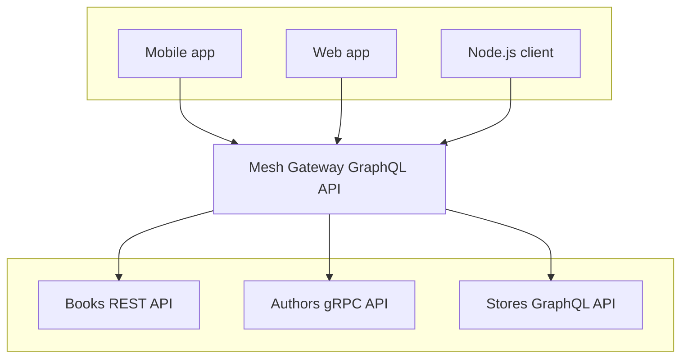
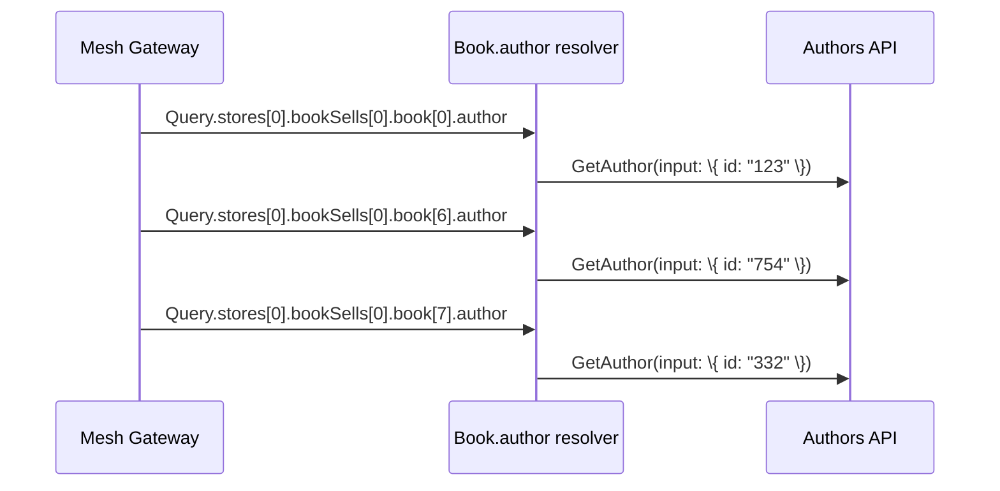
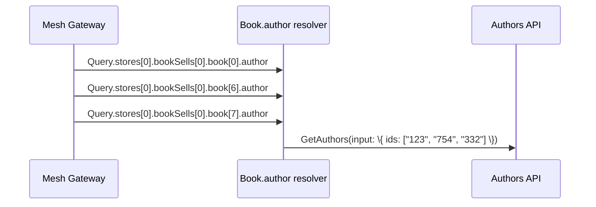

---
description:
  Learn how GraphQL Mesh can solve the N+1 Query problem by batching requests with specific
  parameters. Check out the multiple-sources example.
---

# Batching for N+1 problem

A Mesh Gateway that is not properly configured will face the same famous issue as any other GraphQL
servers: **the N+1 Query problem**.

Fortunately, GraphQL Mesh provides a way to batch requests with specific parameters.

## Enable requests batching

Our
[`multiple-sources`](https://github.com/charlypoly/graphql-mesh-docs-first-gateway/tree/master/packages/multiple-sources)
example Gateway:



Will emit multiple requests to the "Authors" API when resolving the nested `Book.author` field:

```graphql
query bestSellersByStore {
  stores {
    id
    name
    bookSells {
      sellsCount
      book {
        id
        title
        author {
          id
          name
        }
      }
    }
  }
}
```



Fortunately, Mesh allows an extra directive-based configuration to provide a "batching" query that
will help resolve many record of the same type.

Our current resolver configuration for `Book.author` is the following:

[`.meshrc.yaml`](https://github.com/charlypoly/graphql-mesh-docs-first-gateway/tree/master/packages/multiple-sources/.meshrc.yaml)

```yaml filename=".meshrc.yaml"
sources:
  # …
transforms:
  # …
additionalTypeDefs: |
  # …
  extend type Book {
    author: authors_v1_Author @resolveTo(
      sourceName: "Authors", # Which source does the target field belong to?
      sourceTypeName: "Query", # Which root type does the target field belong to?
      sourceFieldName: "authors_v1_AuthorsService_GetAuthor", # What is the source field name?
      requiredSelectionSet: "{ authorId }",
      # What args does this need to take?
      sourceArgs: {
        "input.id": "{root.authorId}"
      }
    )
  }
```

Assuming that the "Authors" is exposing a
`authors_v1_AuthorsService_GetAuthors(input: authors_v1_GetAuthorsRequest_Input)` with
`authors_v1_GetAuthorsRequest_Input` being:

```graphql
input authors_v1_GetAuthorsRequest_Input {
  ids: [String!]!
}
```

We could update our `.meshrc.yaml` configuration as follows:

```yaml filename=".meshrc.yaml"
sources:
  # …
transforms:
  # …

# Create a resolver with batching to solve N+1 problem
additionalTypeDefs: |
  # …
  extend type Book {
    author: authors_v1_Author @resolveTo(
      sourceName: "Authors",
      sourceFieldName: "authors_v1_AuthorsService_GetAuthors",
      keyField: "authorId",
      keysArg: "input.ids"
    )
  }
```

`requiredSelectionSet` and `sourceArgs` got replaced by `keyField` and `keysArg`:

- `keysArg` provides the name of the batching primary key argument (`input.ids` from
  `authors_v1_GetAuthorsRequest_Input`)
- `keyField` indicates which `Book` selection-set field should be used to provide the `ids` value

Now, our Mesh Gateway will try to batch calls to the "Authors" API when resolving `Book.author`:



## Request Batching on the gateway level

Mesh also provides a way to batch requests on the gateway level. This is useful when you want to
send multiple requests to the gateway in a single HTTP request. This follows
[Batching RFC](https://github.com/graphql/graphql-over-http/blob/main/rfcs/Batching.md)

```yaml
serve:
  batchingLimit: 10 # You have to define an explicit limit for batching
```
