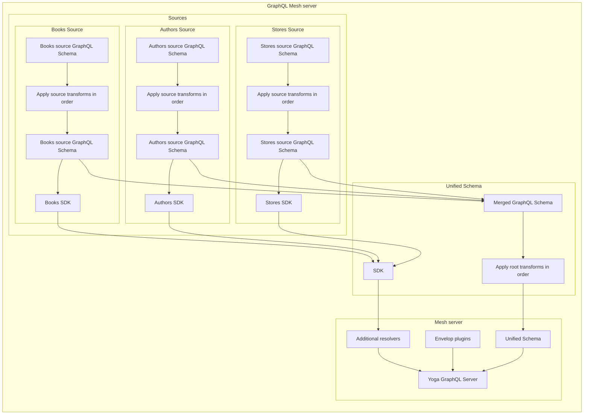

---
description:
  Improve your GraphQL API by using GraphQL Mesh Schema Transformation! Easily modify your schema
  and control the contents of your requests and responses. Learn how to configure and order
  transforms for maximum efficiency.
---

import { Callout } from '@theguild/components'

# Schema Transformation

## Introduction to Transforms

GraphQL Mesh allows you to modify the schema easily, in order to control the contents of your
GraphQL requests and responses; you can use one of the built-in transforms or write your own.

Each transformer can manipulate the schema the way it needs and return the modified schema.

Transforms are specified as a list of objects, and they are executed in order. You can apply them
over a specific input source or over the unified schema (after merging all sources).

## Transforms location and order

Most of the previous Guides configured Transforms at the root of the `.meshrc.yaml` YAML
configuration.

However, Mesh Transforms can be specified at the Source or Root level as follows:

```yaml filename=".meshrc.yaml"
sources:
  - name: Books
    handler:
      openapi:
        source: http://localhost:3002/openapi.json
    transforms:
  - rename:
      renames:
        - from:
            type: Query
            field: categories
          to:
            type: Query
            field: booksCategories
  - name: Authors
    handler:
      grpc:
        endpoint: localhost:3003
  - name: Stores
    handler:
      graphql:
        endpoint: http://0.0.0.0:3004/graphql
transforms:
  - filterSchema:
      filters:
        - Query.stores
```

Specifying transforms at the Source level helps to isolate each Source definition better.

<Callout emoji="⚠️" type="warning">
  However, be careful: transforms performed at the Source level or Root level does not result in the
  same final SDK (potentially later used in `additionalResolvers`).
</Callout>

The diagram below explains how Mesh process applied when building the final unified Schema and SDK:



The above diagram highlights 2 important points when working with transforms:

### Transforms order is important

The sequence diagram shows that Mesh always applies transforms in order, which means a given
transformer can impact the following one.

Given the following `MyService` schema:

```graphql filename="schema.graphql"
type Query {
  books_list: [Book]!
}

# …
```

The following `filterSchema` transforms configuration will fail:

```yaml filename=".meshrc.yaml"
sources:
   - name: MyService
    handler:
      jsonSchema:
        # …

    transforms:
      - namingConvention:
              typeNames: pascalCase
              fieldNames: camelCase
      - filterSchema:
          - Query.books_list
```

Because Mesh process transforms in the definition order, when `filterSchema` is processed, all types
and fields have been transformed to match the configured naming convention. The `Query.books_list`
does not exist anymore, replaced by the `Query.booksList` query.

<Callout>
  Note: the number of configured transforms does not impact performances (build or runtime) since
  Mesh processes them in a chained way
</Callout>

### Beware of which transforms are used at the source level

As stated earlier, transforms applied at the source level impact the generated SDK.

For this reason, be careful when using the `filterSchema` transforms at the Source level since it
will also remove it from the SDK, which will make it impossible to use it at the additional
resolvers level.

For example:

```yaml filename=".meshrc.yaml"
sources:
   - name: MyService
    handler:
      jsonSchema:
        # ...

    transforms:
      - filterSchema:
          - Query.books_list
```

The above `filterSchema` Transforms will prevent calling the `books_list` Query SDK method from the
`additionalResolvers`.

(_The `MyService.Query.books_list()` SDK method won't be generated_)

## Two different modes

By default, most transform manipulating schemas work by wrapping the original schema. Still,
recently we have also introduced a new "bare" mode to replace the original schema with the
transformed one. Although both `bare` and `wrap` modes apparently achieve the same result, their
behaviors are very different. Let's take a look at how they operate.

### Wrap

The wrap mode applies transformations by adding a wrapping layer to the original GraphQL schema. The
handler generates a GraphQL schema and passes it to the transform. When in "wrap" mode, the
transform receives this schema. Rather than updating it, it will apply a layer on top of it, with
the scope of serving your transformations as an addition to the original schema generated by the
handler. This approach is safe as we have used it extensively in `graphql-tools`; however, be
mindful of the implications below.

#### Implications

The wrap mode is the default mode for schema manipulation transforms because it is safe and works
across all data sources. However, you might want to be aware of the following implications.

- Runtime implications Schema wrapping is performed during initialization only and so won't affect
  runtime GraphQL operations. However, transforms altering the original schema shape using the
  "wrap" mode, achieve this by intercepting both the incoming request and original response in order
  to do the mapping required to transform the original schema into the desired shape. Not all
  transforms require interception of both request and response. Some require straightforward
  mapping, so the runtime overhead could hopefully be negligible; however, there will always be
  some.
- Multiple wrapping layers When using "wrap" mode, the required transformation can be achieved by
  adding at least one wrapping layer per each transform rule defined. We cannot have a wrapping
  layer per transform, but we need one per rule since each rule is unique in the way it transforms
  different parts of the schema. Some rules might even require multiple wrapping layers, f.i. When
  transforming a field, the transform needs to be applied to RootFields, ObjectFields, and
  InputObjectFields. As explained in the previous point, the wrapping layers are registered during
  initialization only. However, each wrapping layer will always have some runtime implications, even
  if hopefully negligible.
- Working with fixed-schema sources As mentioned, "wrap" is the only mode that works for sources
  that "speak" GraphQL natively. However, when you work with fixed schema sources, such as
  JSON-schema, OpenApi, SOAP, ..., schema wrapping might have some undesired effects; f.i. You won't
  have access to the original "fixed-contract" response from your data source. This might not be
  ideal, for example, when implementing custom resolvers, where you might want to access several
  properties returned by your REST service to compute custom data. Still, you will only be able to
  access properties requested with the GraphQL query. If you don't want/can't opt into "bare" mode,
  this can be easily solved by explicitly declaring a `SelectionSet`, within your custom resolver to
  list all properties required to compute your custom data.

<Callout>
  Note: "wrap" is the only approach that works with data sources that already "speaks" GraphQL, or
  when you want to transform at all sources (root) level, unless you're using
  [merger-bare](/docs/api/modules/merger-bare). If you want to remove the possible runtime
  implications, consider either moving your transforms at the data source level or opting into
  `merger-bare`; in order to take advantage of "bare" mode.
</Callout>

Example:

```yaml filename=".meshrc.yaml"
sources:
  - name: Countries
    handler:
      graphql:
        endpoint: https://api.../graphql
    transforms:
      - rename:
          mode: wrap # bare won't work here, since this data source already "speaks" GraphQL
          renames:
            - from:
                type: Country
                field: admin1Admins
              to:
                type: Country
                field: admin1
  - name: Users
    handler:
      openapi:
        source: https://api.../swagger.yaml
    transforms:
      - rename:
          mode: wrap # you can use either wrap or bare here
          renames:
            - from:
                type: User
                field: lastName
              to:
                type: User
                field: surname
transforms:
  - rename:
      mode: wrap # bare won't work here at all-sources (root) level, because you're not using merger-bare
      renames:
        - from:
            type: Country
            field: ISO-3166_Code
          to:
            type: Country
            field: code
```

<Callout emoji="🪄">
  ProTip: When you want to use "wrap", you can omit the "mode" property since this is already
  applied by default.
</Callout>

### Bare

Bare is a recent addition and works by replacing the original schema. The handler generates a
GraphQL schema and passes it to the transform. When in "bare" mode, the transform, receives the
schema generated by your handler, applies the transform rules defined and finally returns an updated
version of the original schema. This means that the transformed schema replaces the original schema
from the handler and so Mesh deals with the latter schema only, as opposed to an original schema
plus one or more wrapping layers. Bare mode does remove all the
[implications of "wrap" mode](#implications), however, be mindful of the restrictions below.

#### Restrictions

Bare does provide performance improvements over "wrap", however it has a main restriction: it needs
to access the bare schema. Here are some reasons why this might not work:

- Your data source already "speaks" GraphQL In this case "bare" won't work as it cannot replace a
  native GraphQL schema. This is not the same as transforming a "translated" GraphQL schema (e.g.
  from JSON-schema, OpenApi, SOAP, etc.). The suggestion in this case is to apply "wrap" transforms
  to your GraphQL data sources and "bare" transforms to source "translated" into GraphQL.

- You are applying transforms at all-sources (root) level This means that "bare" would receive a
  composed GraphQL schema, rather than a bare and "translated" schema. If you do want to use "bare"
  at the root level, your only choice is to opt into [merger-bare](/docs/api/modules/merger-bare),
  which lets transforms access the bare schemas; because it merges sources without wrapping them.
  This works when you don't have (or you take care of) conflicts between your sources, and you are
  not applying root-level transforms to data sources that already "speaks" GraphQL.

- You are mixing transforms that support "bare" with transforms that don't Again, "bare" always
  needs to access the bare schema. If you define other transforms that don't support "bare" mode,
  you will most likely have troubles, since those transforms will apply a wrapping layer which will
  provide "bare" transforms the wrapping layer, as opposed to the original bare schema. In order to
  take advantage of "bare" performance improvements, the suggestion here is to apply "wrap"
  transforms at the all-sources (root) level and "bare" transforms within the data sources level; so
  that at least you are able to reduce the number of wrapping layers that would otherwise be created
  if not using "bare" at all.

Example:

```yaml filename=".meshrc.yaml"
sources:
  - name: Countries
    handler:
      soap:
        source: http://webservices.../wso?WSDL
  - name: Users
    handler:
      openapi:
        source: https://api.../swagger.yaml
    transforms:
      - rename:
          mode: bare # bare is a great choice here, at the data source level
          renames:
            - from:
                type: User
                field: lastName
              to:
                type: User
                field: surname
merger: bare # this lets transforms access the bare schemas
transforms:
  - rename:
      mode: bare # bare will work here, at all-sources (root) level, because you're using merger-bare
      renames:
        - from:
            type: Country
            field: ISO-3166_Code
          to:
            type: Country
            field: code
```

### Modes support

The table below illustrates how "bare" and "wrap" modes are supported across all transforms. If you
have use cases for which you would require to introduce either "bare" or "wrap" mode to one of the
transforms, feel free to
[open a feature request](https://github.com/ardatan/graphql-mesh/issues/new/choose).

| Transform             | Bare | Wrap |                      Docs                      |
| --------------------- | :--: | :--: | :--------------------------------------------: |
| Encapsulate           |  ❌  |  ✅  |      [docs](/docs/transforms/encapsulate)      |
| Extend                |  ✅  |  ❌  |        [docs](/docs/transforms/extend)         |
| Federation            |  ❌  |  ✅  |      [docs](/docs/transforms/federation)       |
| Filter Schema         |  ✅  |  ✅  |     [docs](/docs/transforms/filter-schema)     |
| hoist                 |      |      |         [docs](/docs/transforms/hoist)         |
| Naming Convention     |  ✅  |  ✅  |   [docs](/docs/transforms/naming-convention)   |
| Prefix                |  ✅  |  ✅  |        [docs](/docs/transforms/prefix)         |
| prune                 |      |      |         [docs](/docs/transforms/prune)         |
| Rename                |  ✅  |  ✅  |        [docs](/docs/transforms/rename)         |
| Replace Field         |  ✅  |  ❌  |     [docs](/docs/transforms/replace-field)     |
| Resolvers Composition |  ✅  |  ✅  | [docs](/docs/transforms/resolvers-composition) |
| type-merging          |      |      |     [docs](/docs/transforms/type-merging)      |
