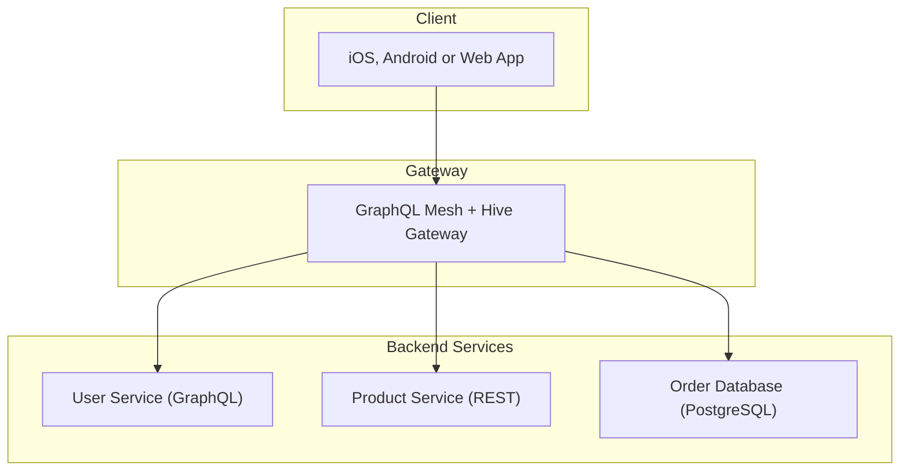

---
description:
  GraphQL Mesh is a framework that allows you to build GraphQL gateways and APIs using GraphQL or
  non-GraphQL sources
---

import { Callout, Cards } from '@theguild/components'

# Introduction

GraphQL Mesh is a [GraphQL Federation](https://the-guild.dev/graphql/hive/federation) framework for
both GraphQL Federation and non-GraphQL Federation subgraphs, non-GraphQL services, such as REST and
gRPC, and also databases such as MongoDB, MySQL, and PostgreSQL.

GraphQL Mesh allows you to use GraphQL query language to access data in remote APIs that don't run
GraphQL (and also ones that do run GraphQL). It can be used as a gateway to other services or run as
a local GraphQL schema that aggregates data from remote APIs.

The goal of GraphQL Mesh is to let developers easily access services that are written in other APIs
specs (such as gRPC, OpenAPI/Swagger, OData, SOAP/WSDL, Apache Thrift, Mongoose, PostgreSQL, Neo4j,
and also GraphQL) with GraphQL queries and mutations.

GraphQL Mesh gives the developer the ability to modify the output schemas, link types across schemas
and merge schema types. You can even add custom GraphQL types and resolvers that fit your needs.

It allows developers to control the way they fetch data, and overcome issues related to backend
implementation, legacy API services, chosen schema specification and non-typed APIs.

GraphQL Mesh is acting as a proxy to your data, and uses common libraries to wrap your existing API
services. You can use this proxy locally in your service or application by running the GraphQL
schema locally (with GraphQL execute), or you can deploy this as a gateway layer to your internal
service.

- **Mesh Compose** Combine multiple API sources (GraphQL, Federation, REST, gRPC, PostgreSQL, MySql
  and co) into a single GraphQL supergraph.

- **Hive Gateway** The Gateway to serve your existing supergraph as provided by either Mesh Compose,
  GraphQL Hive, Apollo GraphOS, or a proxy to your existing GraphQL API. Flexible support for
  authentication, authorization, caching, rate-limiting and observability.

### Next steps

Want to turn existing services into a GraphQL supergraph or a subgraph? Continue with Mesh Compose.

Already have a supergraph from a schema registry such as GraphQL Hive or Apollo GraphOS and want to
spin up a gateway? Continue with Hive Gateway.

<Cards>
  <Cards.Card arrow title="Get Started with Mesh Compose" href="/v1/getting-started" />
  <Cards.Card
    arrow
    title="Get Started with Hive Gateway"
    href="https://the-guild.dev/graphql/hive/docs/gateway"
  />
</Cards>
