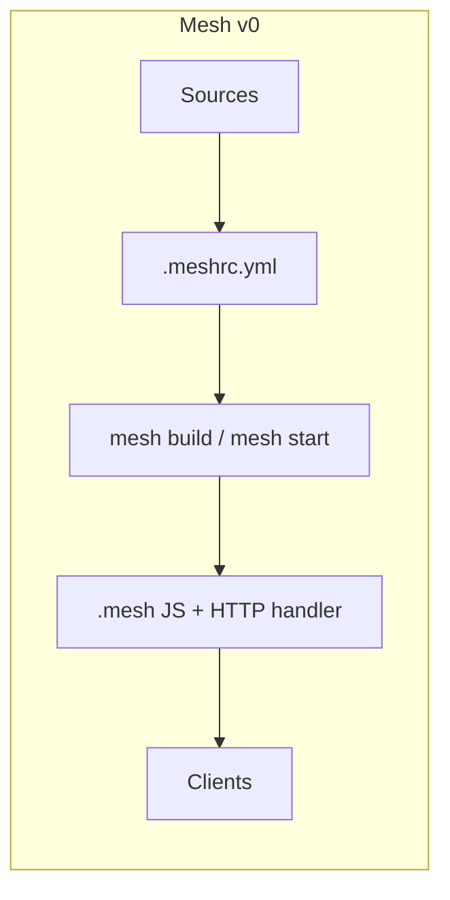
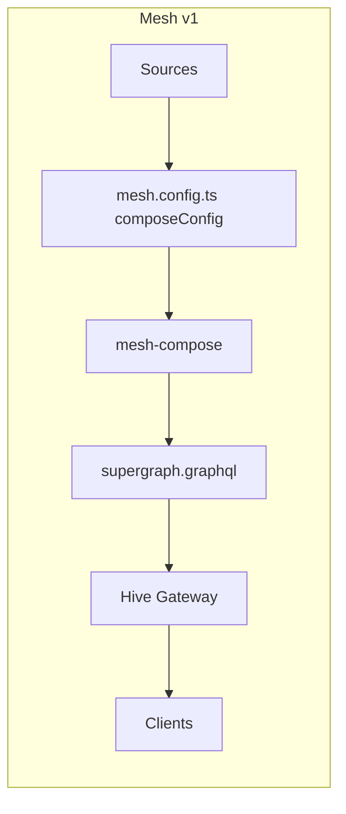

import { Callout } from '@theguild/components'

# Migration from GraphQL Mesh v0 (Experimental - Beta)

<Callout>This feature is still work-in-progress. Please report any issues you encounter.</Callout>

This page is for people coming from Mesh **v0** (`.meshrc.yml`, `@graphql-mesh/cli`, `.mesh`
artifacts). Mesh **v1** is a different product shape: **Compose** builds a Supergraph SDL, **Hive
Gateway** serves it. The sections below keep the original v0 concepts and show what they became.

<Callout>
  Please make sure all of your `@graphql-mesh/` packages are up-to-date on v0 first. Otherwise, the
  migration script may not parse your config as expected.
</Callout>

## What changed (v0 vs v1)

If you are migrating from GraphQL Mesh v0, you should be aware of the following changes:

- GraphQL Mesh no longer comes with a built-in gateway. You should setup Hive Gateway to serve the
  generated artifacts.
- GraphQL Mesh no longer generates an executable JavaScript code in `.mesh` folder, but instead it
  builds a GraphQL SDL (Supergraph or Subgraph) that you can use with Hive Gateway.
- GraphQL Mesh Transforms no longer have `bare` mode. There is only `wrap` mode now, and all the
  transforms are using Federation-compatible directives. Any transformed subgraph should be served
  using Hive Gateway.
- If you deploy GraphQL Mesh v0 by using the http handler provided in the artifacts under `.mesh`,
  now you should take a look at
  [Hive Gateway's Deployment Guide](https://the-guild.dev/graphql/hive/docs/gateway/deployment) to
  deploy your gateway.
- GraphQL Mesh no longer runs [GraphQL Code Generator](https://graphql-codegen.com) internally, and
  it no longer writes a typed SDK into `.mesh`. You still get a type-safe SDK: generate it with
  Codegen, then execute through Hive Gateway (`sdkRequester`). See [Type-safe SDK](#type-safe-sdk)
  below.
- GraphQL Mesh no longer generates a Persisted Operations store. You should setup your gateway based
  on your needs. [See here](https://the-guild.dev/graphql/hive/docs/gateway/persisted-documents) for
  more information.

GraphQL Mesh is now only responsible of generating a GraphQL SDL file `supergraph.graphql` or
`subgraph.graphql` that you can use with Hive Gateway. It is not responsible for serving the
generated artifacts.

| Topic                | v0                                                                 | v1                                                                                                                                |
| -------------------- | ------------------------------------------------------------------ | --------------------------------------------------------------------------------------------------------------------------------- |
| Role of Mesh         | One runtime: load sources, merge, transform, **and** serve GraphQL | **Compose only**: produce Supergraph/Subgraph SDL                                                                                 |
| Serving              | Built into `@graphql-mesh/cli` (`mesh dev` / `mesh start`)         | [Hive Gateway](https://the-guild.dev/graphql/hive/docs/gateway) (`hive-gateway supergraph`)                                       |
| Config               | `.meshrc.yml` / `.meshrc.yaml` / `.meshrc.json` / `.meshrc.js`     | `mesh.config.ts` (or `.js`) with `composeConfig` + `gatewayConfig`                                                                |
| Packages             | `@graphql-mesh/cli` + `@graphql-mesh/<handler>`                    | `@graphql-mesh/compose-cli` + `@omnigraph/*` + `@graphql-hive/gateway`                                                            |
| Output               | `.mesh/` (JS SDK, `execute`, HTTP handler, schema)                 | `supergraph.graphql` (or `.js`) — SDL, not a Node server                                                                          |
| Schema merge         | `merger` (stitching / bare / federation)                           | Federation-compatible composition                                                                                                 |
| Transforms           | `bare` or `wrap`; can sit on a source **or** on the unified schema | Wrap only; **source-level** in compose; Federation directives                                                                     |
| Type merging         | `typeMerging` transform / stitching                                | [Federation transform](/v1/transforms/federation) / [`@resolveTo`](/v1/schema-extensions)                                         |
| Codegen / SDK        | `documents` + `sdk` → `.mesh` `getMeshSDK()`                       | Codegen + Hive Gateway `sdkRequester` ([typed-sdk example](https://github.com/graphql-hive/gateway/tree/main/examples/typed-sdk)) |
| Persisted operations | Mesh-generated store                                               | [Hive Gateway persisted documents](https://the-guild.dev/graphql/hive/docs/gateway/persisted-documents)                           |
| In-process execute   | `getBuiltMesh()` / `.mesh` `execute`                               | [Local Execution](/v1/local-execution) via Hive Gateway executor                                                                  |





## Mental model: sources vs subgraphs

v0 called each upstream a **source** (handler + optional transforms), then merged them into a
**unified schema**. v1 calls each upstream a **subgraph**. Compose loads it with a `sourceHandler`,
applies transforms on that subgraph, then composes a **supergraph**.

| v0                                  | v1                                                                                             |
| ----------------------------------- | ---------------------------------------------------------------------------------------------- |
| `sources[].name`                    | First argument of `loadOpenAPISubgraph('Wiki', …)` / `loadGraphQLHTTPSubgraph('Countries', …)` |
| `sources[].handler.openapi`         | `sourceHandler: loadOpenAPISubgraph(...)`                                                      |
| `sources[].transforms`              | `subgraphs[].transforms: [createPrefixTransform(...)]`                                         |
| Root `transforms:` (unified schema) | **Not supported** — move onto a subgraph or use Federation                                     |
| `additionalTypeDefs`                | `composeConfig.additionalTypeDefs` (often with `@resolveTo`)                                   |
| `additionalResolvers`               | `gatewayConfig.additionalResolvers` (runtime, not compose)                                     |

## Configuration Format

Before, Mesh used `.meshrc.yml` (or yaml/json/js). Now Mesh uses `mesh.config.ts` / `mesh.config.js`
with two exports:

- `composeConfig` — what **Mesh Compose** reads (`mesh-compose`)
- `gatewayConfig` — what **Hive Gateway** reads (`hive-gateway`)

The same file can hold both so one project still has a single config, but the jobs are split.

### Example: same gateway, two configs

v0 `.meshrc.yml`:

```yaml filename=".meshrc.yml"
sources:
  - name: Wiki
    handler:
      openapi:
        source: ./wiki.yaml
    transforms:
      - prefix:
          value: Wiki_
  - name: Countries
    handler:
      graphql:
        endpoint: https://countries.trevorblades.com
serve:
  port: 4000
  cors:
    origin: '*'
plugins:
  - responseCache:
      ttl: 1000
```

v1 `mesh.config.ts` (what the migrator aims to produce):

```ts filename="mesh.config.ts"
import {
  createPrefixTransform,
  defineConfig as defineComposeConfig,
  loadGraphQLHTTPSubgraph
} from '@graphql-mesh/compose-cli'
import { defineConfig as defineGatewayConfig } from '@graphql-hive/gateway'
import { loadOpenAPISubgraph } from '@omnigraph/openapi'

export const composeConfig = defineComposeConfig({
  subgraphs: [
    {
      sourceHandler: loadOpenAPISubgraph('Wiki', { source: './wiki.yaml' }),
      transforms: [createPrefixTransform({ value: 'Wiki_' })]
    },
    {
      sourceHandler: loadGraphQLHTTPSubgraph('Countries', {
        endpoint: 'https://countries.trevorblades.com'
      })
    }
  ]
})

export const gatewayConfig = defineGatewayConfig({
  port: 4000,
  cors: { origin: '*' },
  responseCaching: { ttl: 1000 }
})
```

### Run the migrator

Install `@graphql-mesh/migrate-config-cli` to generate `mesh.config.ts` from your v0 file.

```sh npm2yarn
npm install @graphql-mesh/migrate-config-cli
```

Then run the following command in your project directory:

```sh
npx mesh-migrate-config
```

Optional flags:

| Flag          | Meaning                                        |
| ------------- | ---------------------------------------------- |
| `--dry-run`   | Print `mesh.config.ts` to stdout, do not write |
| `--force`     | Overwrite an existing `mesh.config.ts`         |
| `[directory]` | Project root (default: cwd)                    |

During the migration process, you might get some errors or warnings related to the deprecated or
removed functionalities. Please make sure to update your legacy v0 configuration and setup according
to those warnings and errors.

- **Errors** mean the CLI **did not write** `mesh.config.ts` (root-level transforms, unknown
  handler, removed transform such as `typeMerging`).
- **Warnings** mean it wrote a file, but you still have manual work (codegen, pubsub, merger, …).

<Callout>
  The config migrator is still experimental. Review `mesh.config.ts` and the messages it prints.
  Please report anything it gets wrong.
</Callout>

## CLI and daily workflow

| Goal                                     | v0                           | v1                                                                                                   |
| ---------------------------------------- | ---------------------------- | ---------------------------------------------------------------------------------------------------- |
| Dev server (rebuild schema from sources) | `mesh dev`                   | `mesh-compose -o supergraph.graphql` then `hive-gateway supergraph` (re-compose when sources change) |
| Production schema artifacts              | `mesh build` → `.mesh/`      | `mesh-compose -o supergraph.graphql`                                                                 |
| Production HTTP server                   | `mesh start` (loads `.mesh`) | `hive-gateway supergraph` (loads SDL)                                                                |
| Validate                                 | `mesh validate`              | Compose + Gateway config / Hive schema checks                                                        |
| Serve a single source                    | `mesh serve-source`          | Compose one subgraph, or point Hive Gateway at that subgraph SDL                                     |

v0 `package.json` often looked like `"dev": "mesh dev"`, `"build": "mesh build"`,
`"start": "mesh start"`. v1 splits that into compose (CI / build) and gateway (runtime).

## Package Changes

Instead of `@graphql-mesh/cli`, you should now use `@graphql-mesh/compose-cli` and
`@graphql-hive/gateway`.

```sh npm2yarn
npm uninstall @graphql-mesh/cli
npm install @graphql-mesh/compose-cli @graphql-hive/gateway
```

Source handler packages moved from `@graphql-mesh/<handler>` to `@omnigraph/*` (GraphQL HTTP stays
on compose-cli). The migrator prints the exact add/remove list for **your** config.

| v0 `handler`   | v0 package                                      | v1 loader                                          | v1 package                  |
| -------------- | ----------------------------------------------- | -------------------------------------------------- | --------------------------- |
| `graphql`      | `@graphql-mesh/graphql`                         | `loadGraphQLHTTPSubgraph`                          | `@graphql-mesh/compose-cli` |
| `openapi`      | `@graphql-mesh/openapi`                         | `loadOpenAPISubgraph`                              | `@omnigraph/openapi`        |
| `jsonSchema`   | `@graphql-mesh/json-schema`                     | `loadJSONSchemaSubgraph`                           | `@omnigraph/json-schema`    |
| `grpc`         | `@graphql-mesh/grpc`                            | `loadGRPCSubgraph`                                 | `@omnigraph/grpc`           |
| `soap`         | `@graphql-mesh/soap`                            | `loadSOAPSubgraph`                                 | `@omnigraph/soap`           |
| `raml`         | `@graphql-mesh/raml`                            | `loadRAMLSubgraph`                                 | `@omnigraph/raml`           |
| `mysql`        | `@graphql-mesh/mysql`                           | `loadMySQLSubgraph`                                | `@omnigraph/mysql`          |
| `postgraphile` | `@graphql-mesh/postgraphile`                    | `loadPostgreSQLSubgraph`                           | `@omnigraph/postgresql`     |
| `mongoose`     | `@graphql-mesh/mongoose`                        | `loadMongooseSubgraph`                             | `@omnigraph/mongoose`       |
| `neo4j`        | `@graphql-mesh/neo4j`                           | `loadNeo4jSubgraph`                                | `@omnigraph/neo4j`          |
| `odata`        | `@graphql-mesh/odata`                           | `loadODataSubgraph`                                | `@omnigraph/odata`          |
| `thrift`       | `@graphql-mesh/thrift`                          | `loadThriftSubgraph`                               | `@omnigraph/thrift`         |
| `tuql`         | `@graphql-mesh/tuql`                            | `loadSQLiteSubgraph`                               | `@omnigraph/sqlite`         |
| `supergraph`   | consume an existing supergraph as a Mesh source | **Do not compose.** Give that SDL to Hive Gateway. | `@graphql-hive/gateway`     |

GraphQL handler differences the migrator knows about:

- v0 HTTP `{ endpoint }` → v1 `loadGraphQLHTTPSubgraph(name, { endpoint })` (copied as-is).
- v0 code-first `{ source: './schema.ts' }` → v1 `{ endpoint: './schema.ts' }` (the v1 loader uses
  `endpoint` for URL **or** a local schema file).
- v0 `sources` + `fallback` / `race` / `highestValue` is **not** auto-migrated. In v0 that was one
  handler with several HTTP backends. In v1, split them into subgraphs or keep a single endpoint.

See [Source Handlers](/v1/source-handlers).

## Transforms

v0 transforms could run in `bare` mode (mutate the schema in place) or `wrap` mode (schema
wrapping). v1 only wraps, and emits Federation-compatible directives, so the result must be served
by Hive Gateway (or another Federation-aware gateway). `mode: wrap` in YAML is dropped; it is
implied.

v0 allowed **root-level** `transforms:` on the unified schema. v1 does **not**. Move them onto the
relevant source, or replace stitching with [Federation](/v1/transforms/federation).

| v0 transform           | v1                                | What is different                                                                    |
| ---------------------- | --------------------------------- | ------------------------------------------------------------------------------------ |
| `prefix`               | `createPrefixTransform`           | Same idea; [docs](/v1/transforms/prefix)                                             |
| `rename`               | `createRenameTransform`           | [docs](/v1/transforms/rename)                                                        |
| `filterSchema`         | `createFilterTransform`           | Drop `mode`. A YAML list of globs becomes `{ filters: [...] }`                       |
| `encapsulate`          | `createEncapsulateTransform`      | [docs](/v1/transforms/encapsulate)                                                   |
| `namingConvention`     | `createNamingConventionTransform` | [docs](/v1/transforms/naming-convention)                                             |
| `hoistField`           | `createHoistFieldTransform`       | v0 array → `{ mapping: [...] }`                                                      |
| `prune`                | `createPruneTransform`            | [docs](/v1/transforms/prune)                                                         |
| `federation`           | `createFederationTransform`       | How you declare keys / `@merge` in v1                                                |
| `extend`               | `createExtendTransform(typeDefs)` | `typeDefs` stay in compose; `extend.resolvers` → `gatewayConfig.additionalResolvers` |
| `typeMerging`          | **manual**                        | Stitching-style merge → Federation / [type merging](/v1/type-merging)                |
| `cache`                | **manual**                        | Was a transform; now a **gateway** plugin — [response caching](/v1/response-caching) |
| `rateLimit`            | **manual**                        | Was a transform; now gateway / `@rateLimit` — [rate limit](/v1/rate-limit)           |
| `replaceField`         | **manual**                        | Use hoist, rename, or `additionalTypeDefs`                                           |
| `resolversComposition` | **manual**                        | `additionalResolvers` or a gateway plugin                                            |

## Serve, plugins, and runtime (compose vs gateway)

In v0, `serve`, `plugins`, `cache`, and `customFetch` lived next to `sources` in one YAML file. In
v1, anything that **builds SDL** is compose; anything that **runs requests** is Hive Gateway.

| v0                                                                                           | v1                                                                                              |
| -------------------------------------------------------------------------------------------- | ----------------------------------------------------------------------------------------------- |
| `sources`, source `transforms`, `additionalTypeDefs`, `customFetch` used while introspecting | `composeConfig` (`fetch` on compose)                                                            |
| `serve.*`, `plugins`, `cache`, `additionalResolvers`, `logger`, runtime `customFetch`        | `gatewayConfig` (`fetchAPI.fetch`)                                                              |
| `codegen`, `sdk`, `documents`                                                                | GraphQL Codegen on the **supergraph** + Hive Gateway typed SDK (not Mesh CLI)                   |
| `merger`                                                                                     | No replacement key; composition is Federation-style (migrator warns)                            |
| `pubsub`                                                                                     | Hive Gateway subscriptions — [docs](/v1/subscriptions-webhooks)                                 |
| `persistedOperations`                                                                        | [Hive persisted documents](https://the-guild.dev/graphql/hive/docs/gateway/persisted-documents) |
| `serve.extraParamNames`, `serve.browser`                                                     | not migrated                                                                                    |

### `serve` field names

| v0 `serve`                                    | v1 `gatewayConfig`           |
| --------------------------------------------- | ---------------------------- |
| `port`                                        | `port`                       |
| `hostname`                                    | `host`                       |
| `endpoint` (GraphQL path, default `/graphql`) | `graphqlEndpoint`            |
| `playground: false`                           | `graphiql: false`            |
| `playgroundTitle`                             | `graphiql: { title }`        |
| `cors`                                        | `cors`                       |
| `healthCheckEndpoint`                         | `healthCheckEndpoint`        |
| `batchingLimit`                               | `batching: { limit }`        |
| `sslCredentials`                              | `sslCredentials`             |
| `fork`                                        | `fork`                       |
| `staticFiles`                                 | `useStaticFiles(...)` plugin |
| `browser`                                     | skipped (dev-only auto-open) |

### Plugins

| v0 `plugins`                         | v1                                                                        |
| ------------------------------------ | ------------------------------------------------------------------------- |
| `hive`                               | `reporting: { type: 'hive', ... }` and `persistedDocuments` when set      |
| `responseCache`                      | `responseCaching`                                                         |
| `rateLimit`                          | `rateLimiting`                                                            |
| `prometheus`                         | `prometheus`                                                              |
| `maskedErrors`                       | `maskedErrors`                                                            |
| `immediateIntrospection`             | `useImmediateIntrospection()` in `plugins`                                |
| other Envelop / Yoga / Armor plugins | resolved when possible; otherwise add to `gatewayConfig.plugins` yourself |

v0 `cache:` (Redis, Localforage, …) becomes `gatewayConfig.cache: new Cache(...)` with
`@graphql-mesh/cache-*`. That is **not** the old Cache **transform**.

## Type-safe SDK

v0 Mesh **was** an SDK generator. `documents` + `sdk` in `.meshrc` plus `mesh build` wrote
`getMeshSDK()` into `.mesh`. v1 Mesh Compose does **not** do that. The same pattern is the
[Hive Gateway typed-sdk example](https://github.com/graphql-hive/gateway/tree/main/examples/typed-sdk):
Codegen emits `getSdk`, Hive Gateway supplies `sdkRequester`.

| v0                                                   | v1                                                                              |
| ---------------------------------------------------- | ------------------------------------------------------------------------------- |
| `documents: ['./src/**/*.graphql']`                  | Codegen `documents` (e.g. `sdk/operations.graphql`)                             |
| `sdk: { generateOperations: { selectionSetDepth } }` | You own the `.graphql` operations; Codegen does not invent them from Mesh       |
| `mesh build` → `.mesh` SDK                           | `graphql-codegen` against `supergraph.graphql`                                  |
| `import { getMeshSDK } from './.mesh'`               | `import { getSdk } from './sdk/generated'`                                      |
| `getMeshSDK()`                                       | `getSdk(runtime.sdkRequester)` or `getSdk(getSdkRequesterForUnifiedGraph(...))` |

v0:

```ts
import { getMeshSDK } from './.mesh'

const sdk = getMeshSDK()
const { getSomething } = await sdk.myQuery({ someVar: 'foo' })
```

v1 — same stack as the
[Hive Gateway typed-sdk example](https://github.com/graphql-hive/gateway/tree/main/examples/typed-sdk)
([CodeSandbox](https://githubbox.com/graphql-hive/gateway/tree/main/examples/typed-sdk)):

```ts filename="codegen.ts"
import type { CodegenConfig } from '@graphql-codegen/cli'

export default {
  schema: './supergraph.graphql',
  documents: 'sdk/operations.graphql',
  generates: {
    'sdk/generated.ts': {
      plugins: ['typescript-operations', 'typescript-generic-sdk']
    }
  }
} satisfies CodegenConfig
```

```ts
import { readFileSync } from 'node:fs'
import { createGatewayRuntime } from '@graphql-hive/gateway'
import { getSdk } from './sdk/generated'

await using runtime = createGatewayRuntime({
  supergraph: readFileSync('./supergraph.graphql', 'utf-8')
})

const sdk = getSdk(runtime.sdkRequester)
const todos = await sdk.Todos()
```

The example also runs mutations and subscriptions on the same `getSdk` (`sdk.AddTodo(...)`,
`sdk.TodoAdded()` as an async iterable). See
[`example.ts`](https://github.com/graphql-hive/gateway/blob/main/examples/typed-sdk/example.ts).

If you only need in-process execution without `createGatewayRuntime`, use
`getSdkRequesterForUnifiedGraph` as in [Local Execution](/v1/local-execution). Compose the
supergraph first (`mesh-compose -o supergraph.graphql`); Codegen’s `schema` must point at that file
(or `supergraph.js`), not at `.mesh`.

The migrator **warns** on `sdk` / `codegen` / `documents` and does not generate `codegen.ts`. Copy
your v0 `documents` into Codegen yourself.

## Using Artifacts

GraphQL Mesh no longer generates artifacts with `execute` or `createBuiltMeshHTTPHandler`. v0
deployment used those from `.mesh` after `mesh build`. v1 deployment uses an SDL file plus Hive
Gateway.

| v0 artifact                                 | v1                                                                                                                                       |
| ------------------------------------------- | ---------------------------------------------------------------------------------------------------------------------------------------- |
| `.mesh/index.js` `getBuiltMesh` / `execute` | Compose SDL + [local execution](/v1/local-execution) (`getExecutorForUnifiedGraph`)                                                      |
| `.mesh` `createBuiltMeshHTTPHandler`        | Hive Gateway Node / serverless adapters — [deployment](https://the-guild.dev/graphql/hive/docs/gateway/deployment)                       |
| Generated SDK from `sdk:` / `getMeshSDK()`  | Codegen generic SDK + `runtime.sdkRequester` — [typed-sdk example](https://github.com/graphql-hive/gateway/tree/main/examples/typed-sdk) |
| Playground on `mesh dev`                    | GraphiQL on Hive Gateway                                                                                                                 |

After a successful config migration:

1. Install the packages the CLI printed and remove the old handler/CLI packages.
2. Fix every error/warning (especially root transforms and type merging).
3. Run `npx mesh-compose -o supergraph.graphql` to generate the supergraph schema.
4. Run `npx hive-gateway supergraph` to start the gateway server.

Read more about
[Hive Gateway's Deployment Guide](https://the-guild.dev/graphql/hive/docs/gateway/deployment) to
setup your gateway with the new artifacts.

If you need local execution or a typed SDK, see [Local Execution & SDK](/v1/local-execution) and
[Type-safe SDK](#type-safe-sdk), or clone
[examples/typed-sdk](https://github.com/graphql-hive/gateway/tree/main/examples/typed-sdk). Compose
background: [Getting Started](/v1/getting-started).
