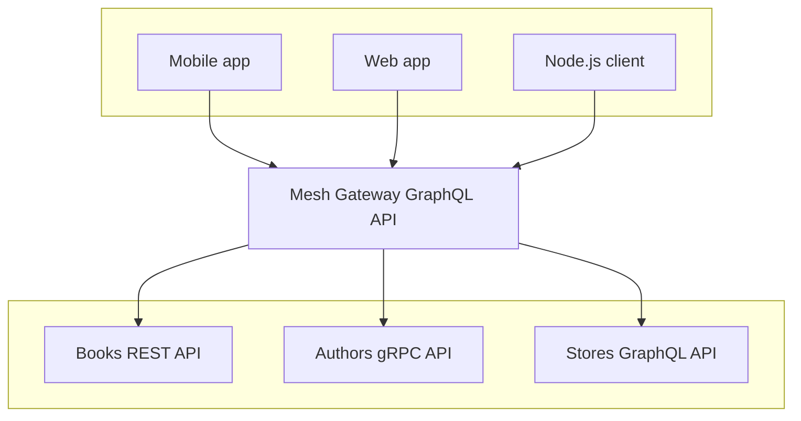

import { Callout } from '@theguild/components'

# How to: Combine multiple Sources

All the documentation tutorials and guides rely on the "Books", "Authors" and "Stores" example APIs, available in a dedicated repository: [`graphql-mesh-docs-first-gateway`](https://github.com/charlypoly/graphql-mesh-docs-first-gateway):

- Books API (REST API)
  - `GET /books`
  - `GET /books/:id`
  - `GET /categories`
- Authors API (gRPC API)
  - `GetAuthor`
  - `ListAuthors`
- Stores (GraphQL API)
  - `stores` Query
  - `bookSells(storeId: ID!)` Query

The getting started ["Your first Gateway with Mesh"](../../docs/getting-started/your-first-mesh-gateway) introduced the configuration of the Books API Source.

This guide will show how to add 2 new sources (Authors and Stores) to achieve the following Gateway setup:



We will go further than just add new Sources by shaping the Unified Schema to accept the following query:

```graphql
query bestSellersByStore {
  stores {
    id
    name
    bookSells {
      sellsCount
      book {
        id
        title
        author {
          id
          name
        }
      }
    }
  }
}
```

## 1. Add the "Authors" Source

The "Authors" Source is a gRPC API: [`authors-service`](https://github.com/charlypoly/graphql-mesh-docs-first-gateway/tree/master/packages/authors-service).

We will use the `grpc` Handler with the `@graphql-mesh/grpc` package and configure in our [`.meshrc.yaml`](https://github.com/charlypoly/graphql-mesh-docs-first-gateway/tree/master/packages/multiple-sources/.meshrc.yaml) it as follows:

```yaml filename=".meshrc.yaml"
sources:
  - name: Books
    handler:
      openapi:
        baseUrl: http://localhost:3002/
        source: ../books-service/openapi3-definition.json
  - name: Authors
    handler:
      grpc:
        endpoint: localhost:3003
        protoFilePath: ../authors-service/proto/authors/v1/authors_service.proto
```

Similar to the "Books" API configuration, we just need to provide the path to the service definition file (here, a Proto file) and the base URL.

We will "clean" the corresponding "Authors" GraphQL Schema later, in the 3rd step, "_Shaping the Unified Schema_".

## 2. Add the "Stores" Source

The "Stores" Source is a GraphQL API: [`stores-service`](https://github.com/charlypoly/graphql-mesh-docs-first-gateway/tree/master/packages/stores-service).

We will use the `graphql` Handler with the `@graphql-mesh/graphql` package and configure it in our [`.meshrc.yaml`](https://github.com/charlypoly/graphql-mesh-docs-first-gateway/tree/master/packages/multiple-sources/.meshrc.yaml) it as follows:

```yaml filename=".meshrc.yaml"
sources:
  - name: Books
    handler:
      openapi:
        baseUrl: http://localhost:3002/
        source: ../books-service/openapi3-definition.json
  - name: Authors
    handler:
      grpc:
        endpoint: localhost:3003
        protoFilePath: ../authors-service/proto/authors/v1/authors_service.proto
  - name: Stores
    handler:
      graphql:
        endpoint: http://0.0.0.0:3004/graphql
```

Since the "Stores" is a GraphQL API, Mesh can leverage introspection to get its schema with just the `endpoint` URL.

## 3. Shaping the Unified Schema

The following Mesh Gateway configuration [`.meshrc.yaml`](https://github.com/charlypoly/graphql-mesh-docs-first-gateway/tree/master/packages/multiple-sources/.meshrc.yaml):

```yaml filename=".meshrc.yaml"
sources:
  - name: Books
    handler:
      openapi:
        baseUrl: http://localhost:3002/
        source: ../books-service/openapi3-definition.json
  - name: Authors
    handler:
      grpc:
        endpoint: localhost:3003
        protoFilePath: ../authors-service/proto/authors/v1/authors_service.proto
  - name: Stores
    handler:
      graphql:
        endpoint: http://0.0.0.0:3004/graphql
```

Will gives us a "raw" GraphQL schema design that contains unwanted GraphQL Queries, badly named types, and a lack of hierarchy:

[`.mesh/schema.graphql`](https://github.com/charlypoly/graphql-mesh-docs-first-gateway/tree/master/packages/multiple-sources/.mesh/schema.graphql)

```graphql
type Query {
  book(id: String!): Book

  books(limit: Int): [Book]

  categories(limit: Int): [Category]
  authors_v1_AuthorsService_GetAuthor(input: authors_v1_GetAuthorRequest_Input): authors_v1_Author
  authors_v1_AuthorsService_ListAuthors(input: authors_v1_ListAuthorsRequest_Input): authors_v1_ListAuthorsResponse
  authors_v1_AuthorsService_connectivityState(tryToConnect: Boolean): ConnectivityState
  stores: [Store!]!
  bookSells(storeId: ID!): [Sells!]!
}

# …
```

In order to achieve a clean Unified Schema design that would allow the following Query:

```graphql
query bestSellersByStore {
  stores {
    id
    name
    bookSells {
      sellsCount
      book {
        id
        title
        author {
          id
          name
        }
      }
    }
  }
}
```

We will need to configure multiple transforms:

- Rename the "Authors" queries
- Remove the unnecessary root queries: `author`, `book`, `categories`, `bookSells`
- Setup some hierarchy between the queries

**If you have never configured Transforms before**, we advise you to go through the ["Your first Gateway with Mesh"](/docs/getting-started/your-first-mesh-gateway) tutorial first.

### Remove unnecessary Root queries

Also covered in the ["Your first Gateway with Mesh"](/docs/getting-started/your-first-mesh-gateway) tutorial, removing queries from the Unified Schema is achieved with the `@graphql-mesh/transform-filter-schema` transform.

To build a clean Unified Schema, we need to remove unnecessary Queries such as:

- `Query.authors_v1_AuthorsService_GetAuthor` and `Query.authors_v1_AuthorsService_ListAuthors` from the "Authors" Source
- the `Query.!authors_v1_AuthorsService_connectivityState` is automatically generated by the `grpc` handler of the "Authors" Source
- `Query.book` from the "Books" Source
- `Query.bookSells` from the "Stores" Source

Our updated [`.meshrc.yaml`](https://github.com/charlypoly/graphql-mesh-docs-first-gateway/tree/master/packages/multiple-sources/.meshrc.yaml) is the following:

```yaml filename=".meshrc.yaml"
sources:
  - name: Books
    handler:
      openapi:
        baseUrl: http://localhost:3002/
        source: ../books-service/openapi3-definition.json
  - name: Authors
    handler:
      grpc:
        endpoint: localhost:3003
        protoFilePath: ../authors-service/proto/authors/v1/authors_service.proto
  - name: Stores
    handler:
      graphql:
        endpoint: http://0.0.0.0:3004/graphql
transforms:
  - filterSchema:
      filters:
        - Query.!authors_v1_AuthorsService_connectivityState
        - Query.!{authors_v1_AuthorsService_GetAuthor, book, bookSells, categories}
```

`filterSchema` takes a `filters` option that accepts an array of filter rules.

By adding `Query.!authors_v1_AuthorsService_connectivityState`, we instruct Mesh to remove the `authors_v1_AuthorsService_connectivityState(...)` Query.

You can notice that the `filterSchema` allows using a bash-like syntax to avoid repetitive configuration with the `{..., ...}` syntax.

Another way to achieve the same result would be to instruct Mesh only to keep the `Query.stores` root query as follows:

```yaml filename=".meshrc.yaml"
sources:
  # ...
transforms:
  - filterSchema:
      filters:
        - Query.stores
```

More information on the `filterSchema` _Transform_ on [its dedicated documentation page](/docs/transforms/filter-schema).

### Setup hierarchy with nested queries

To support the following Query:

```graphql
query bestSellersByStore {
  stores {
    id
    name
    bookSells {
      sellsCount
      book {
        id
        title
        author {
          id
          name
        }
      }
    }
  }
}
```

We need to update the schema to add the following fields:

- `Store.bookSells: [Sells!]!`: to get the selling from a given store
- `Sells.book: Book`: to get the book of a given store selling record
- `Book.author: authors_v1_Author`: to get the author of a book

To achieve this, we will use the `additionalResolvers` and `additionalTypeDefs` configuration from Mesh's `.meshrc.yaml` API.

**Update our Schema with new fields**

Using `additionalTypeDefs` configuration parameter allows writing GraphQL that will be merged with the Unified Schema definition, allowing us to [extend existing types](https://spec.graphql.org/June2018/#sec-Object-Extensions) and queries.

Let's say we want to add the `Book.author` field.
We first need to know what is the type of Author.

Since the handlers generate most types, it might be hard to guess their correct spelling (e.g. `authors_v1_Author`).
A quick way to build an `additionalTypeDefs` is to refer to the generated GraphQL Schema file of each Source that can be found in the [`.mesh/sources`](https://github.com/charlypoly/graphql-mesh-docs-first-gateway/tree/master/packages/multiple-sources/.mesh/sources/) folder.

For example, the GraphQL Schema of the "Authors" Source can be found at [`.mesh/sources/Authors/schema.graphql`](https://github.com/charlypoly/graphql-mesh-docs-first-gateway/tree/master/packages/multiple-sources/.mesh/sources/Authors/schema.graphql) file:

```graphql filename="schema.graphql"
schema {
  query: Query
}

type Query {
  authors_v1_AuthorsService_GetAuthor(input: authors_v1_GetAuthorRequest_Input): authors_v1_Author
  authors_v1_AuthorsService_ListAuthors(input: authors_v1_ListAuthorsRequest_Input): authors_v1_ListAuthorsResponse
  authors_v1_AuthorsService_connectivityState(tryToConnect: Boolean): ConnectivityState
}

type authors_v1_Author {
  id: String
  name: String
  editor: String
}

input authors_v1_GetAuthorRequest_Input {
  id: String
}

type authors_v1_ListAuthorsResponse {
  items: [authors_v1_Author]
}

scalar authors_v1_ListAuthorsRequest_Input
  @specifiedBy(url: "http://www.ecma-international.org/publications/files/ECMA-ST/ECMA-404.pdf")

enum ConnectivityState {
  IDLE
  CONNECTING
  READY
  TRANSIENT_FAILURE
  SHUTDOWN
}
```

<Callout>Note: Try running the Mesh Gateway first if the `.mesh` folder does not exist.</Callout>

Here we find that an author is described with the `authors_v1_Author` GraphQL type, which allows us to add the following `additionalTypeDefs` configuration [`.meshrc.yaml`](https://github.com/charlypoly/graphql-mesh-docs-first-gateway/tree/master/packages/multiple-sources/.meshrc.yaml):

```yaml filename=".meshrc.yaml"
sources:
  # ...
transforms:
  - filterSchema:
      filters:
        - Query.stores
additionalTypeDefs: |
  extend type Book {
    author: authors_v1_Author
  }
```

By applying the same process for `Store.bookSells` and `Sells.book`, we get the following final `additionalTypeDefs` configuration [`.meshrc.yaml`](https://github.com/charlypoly/graphql-mesh-docs-first-gateway/tree/master/packages/multiple-sources/.meshrc.yaml):

```yaml filename=".meshrc.yaml"
sources:
  # ...
transforms:
  - filterSchema:
      filters:
        - Query.stores
additionalTypeDefs: |
  extend type Store {
    bookSells: [Sells!]!
  }
  extend type Sells {
    book: Book
  }
  extend type Book {
    author: authors_v1_Author
  }
```

Our Unified Schema definition is now updated; we need to point to Mesh on how to resolve our new field's data.

**Add resolvers for our new fields**

Now, let's describe **how Mesh should resolve the data on the newly added type definitions** by providing `additionalResolvers`.

Again, let's start with the `Book.author` field.

We need the `Book.author` field to call the `Query.authors_v1_AuthorsService_GetAuthor(input: authors_v1_GetAuthorRequest_Input): authors_v1_Author` Query by providing the following `additionalResolvers` configuration [`.meshrc.yaml`](https://github.com/charlypoly/graphql-mesh-docs-first-gateway/tree/master/packages/multiple-sources/.meshrc.yaml):

```yaml filename=".meshrc.yaml"
sources:
  # ...
transforms:
  - filterSchema:
      filters:
        - Query.stores
additionalTypeDefs: |
  extend type Store {
    bookSells: [Sells!]!
  }
  extend type Sells {
    book: Book
  }
  extend type Book {
    author: authors_v1_Author @resolveTo(
      sourceName: "Authors" # Which source does the target field belong to?
      sourceTypeName: "Query", # Which root type does the target field belong to?
      sourceFieldName: "authors_v1_AuthorsService_GetAuthor", # What is the source field name?
      requiredSelectionSet: "{ authorId }",
      sourceArgs: # What args does this need to take? {
        "input.id": "{root.authorId}"
      }
    )
  }
```

Each `additionalResolvers` value is based on 2 main concepts:

- the **target** (`targetTypeName`, `targetFieldName`): describes the queried field
- the **source** (`sourceName`, `sourceTypeName`, `sourceFieldName`, `sourceArgs`): describes where is resolved the data for the target field

Here are configured **target**, and **Source** explained that Querying `Book.author` will resolve the data by calling the `Query.authors_v1_AuthorsService_GetAuthor` from the "Authors" source.

The `requiredSelectionSet` and `sourceArgs` ensure that the required arguments are provided (`requiredSelectionSet`) and adequately mapped to the Source (`sourceArgs`).
`requiredSelectionSet` ensures that the `Book.author` selection will contains `authorId`, so it can be forward to `Query.authors_v1_AuthorsService_GetAuthor` as the `input.id` argument.

Applying the same logic to `Stores.bookSells` and `Sells.book` gives us a complete [`.meshrc.yaml`](https://github.com/charlypoly/graphql-mesh-docs-first-gateway/tree/master/packages/multiple-sources/.meshrc.yaml) configuration.

Our Gateway is now complete; you can start it (along with the Services APIs) by running:

```sh
yarn start-multiple-sources
```

Then, the following query is now properly resolving all the fields:

```graphql
query bestSellersByStore {
  stores {
    id
    name
    bookSells {
      sellsCount
      book {
        id
        title
        author {
          id
          name
        }
      }
    }
  }
}
```

Which returns the correct data:


Congrats! 🎉

You are now familiar with the basics of GraphQL Mesh:

- Configuring _Sources_, _Handlers_, _Transforms_
- and shaping the _Unified Schema_ with `additionalTypeDefs` and `additionalResolvers`.

## Going further

We provide a set of guides that will help you get started on more realistic scenarios, such as:

- Handling Sources with no definition
- Customize the Mesh server (caching, Envelop plugins)
- Deploying a GraphQL Mesh gateway

As well as some advanced guides for more complex schemas:

- Order of transforms, Sources' Schema, and unified Schema
- Extending the Unified Schema (`additionalResolvers` guide)
- Error handling
- File upload
- Subscriptions & Live Queries
