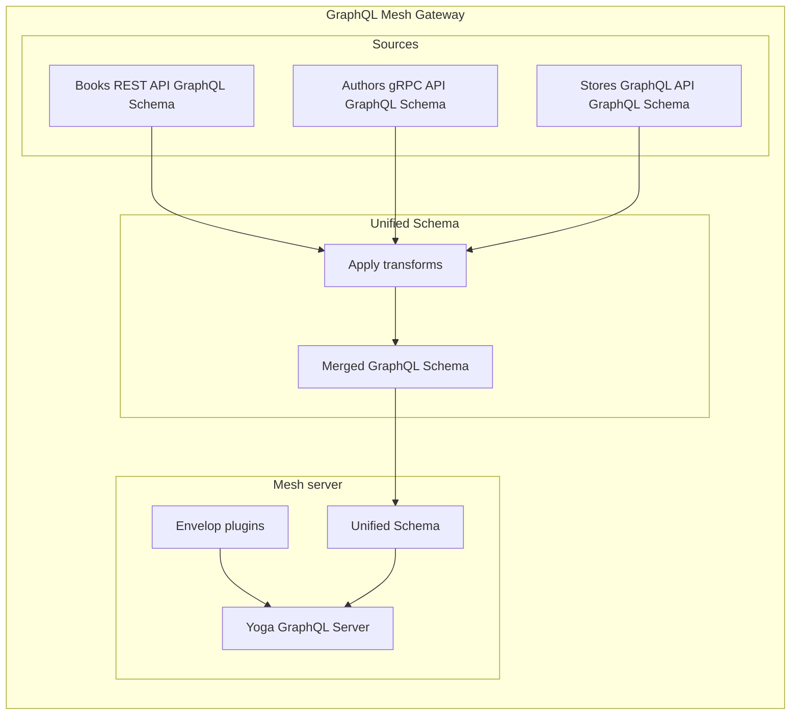

import { Callout } from '@theguild/components'

# How to: Customize the Mesh server

GraphQL Mesh provides a **reliable and production-ready server implementation** built with [GraphQL Yoga](https://graphql-yoga.com) and [Envelop](https://envelop.dev) with, out of the box support for:

- Persisted queries
- Live queries
- Files upload
- Serverless deployment
- [and more...](https://graphql-yoga.com/docs/quick-start)

{/* TODO(charly): add links to "persisted queries" and "live queries" */}



Customizing your GraphQL Mesh Gateway server can be achieved in 2 ways:

- **Configure and provide Envelop plugins**: to add behaviors such as caching, authentication, tracing to your Gateway
- **Provide a standalone server implementation**: to completely replace the server used by the Gateway

## Configure and provide plugins

Aided by the capabilities of [Envelop](https://envelop.dev), you can easily add plugins that helps with security and authentication, advanced caching, error handling, monitoring, logging and much more.

For full list of available plugins, please refer to the [plugins section](/docs/plugins/plugins-introduction).

## Provide a standalone server implementation

> **Disclaimer:** This section explains how to provide a custom server implementation used by `mesh serve` and `mesh dev`. If you are looking for solutions to **deploy Mesh to Serverless environments** or **not rely on `mesh serve`**, please refer to the ["How to: Deploy a Mesh Gateway"](/docs/getting-started/deploy-mesh-gateway) guide.

The following example shows how to replace GraphQL Mesh's default server implementation with [Apollo Server](https://apollographql.com/docs/apollo-server).

GraphQL Mesh uses [Envelop](https://envelop.dev) under the hood, so you need to check other integrations to see how to use `getEnveloped` with other server frameworks. [Envelop Integrations](https://envelop.dev/docs/integrations)

```ts filename="myServerHandler.ts"
import { ApolloServer } from 'apollo-server'
import type { ServeMeshOptions } from '@graphql-mesh/runtime'

export default async function ({ getBuiltMesh, logger, argsPort }: ServeMeshOptions): Promise<void> {
  const { schema, getEnveloped } = await getBuiltMesh()
  const apolloServer = new ApolloServer({
    schema,
    async executor(requestContext) {
      const { schema, execute, contextFactory } = getEnveloped({ req: requestContext.request.http })

      return execute({
        schema,
        document: requestContext.document,
        contextValue: await contextFactory(),
        variableValues: requestContext.request.variables,
        operationName: requestContext.operationName
      })
    }
  })

  const { url } = await apolloServer.listen(argsPort)
  logger.info(`🚀 Server ready at ${url}`)
}
```

Then add the following line to your configuration file:

```yaml filename=".meshrc.yaml"
serve:
  customServerHandler: ./myServerHandler
```

<Callout>When you use a custom server handler, you won't be able to use configuration options under `serve`!</Callout>

## Configuration: `serve` reference

import API from '../../../generated-markdown/ServeConfig.generated.md'

<API />
