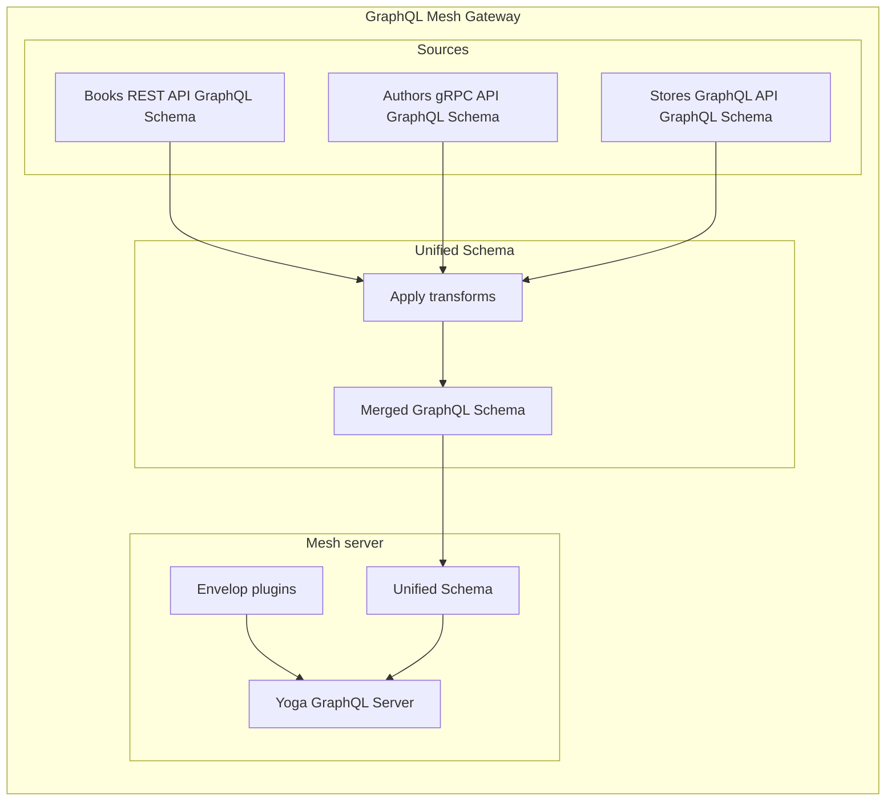

---
description:
  Learn how to customize your Mesh server with GraphQL Yoga and Envelop, and take advantage of
  out-of-the-box features such as persisted queries, live queries, files upload, and serverless
  deployment. Configure or replace the server implementation with plugins and a standalone solution.
---

import { Callout } from '@theguild/components'

# How to: Customize the Mesh server

GraphQL Mesh provides a **reliable and production-ready server implementation** built with
[GraphQL Yoga](https://graphql-yoga.com) and [Envelop](https://envelop.dev) with, out of the box
support for:

- Persisted queries
- Live queries
- Files upload
- Serverless deployment
- [and more...](https://graphql-yoga.com/docs/quick-start)

{/* TODO(charly): add links to "persisted queries" and "live queries" */}

Customizing your GraphQL Mesh Gateway server can be achieved in 2 ways:

- **Configure and provide Envelop plugins**: to add behaviors such as caching, authentication,
  tracing to your Gateway
- **Provide a standalone server implementation**: to completely replace the server used by the
  Gateway

## Configure and provide plugins

Aided by the capabilities of [Envelop](https://envelop.dev), you can easily add plugins that helps
with security and authentication, advanced caching, error handling, monitoring, logging and much
more.

For full list of available plugins, please refer to the
[plugins section](/docs/plugins/plugins-introduction).

## Configuration: `serve` reference

import API from '../../../generated-markdown/ServeConfig.generated.md'

<API />

## Provide a standalone server implementation

Creation of own server with Mesh Gateway and its deployment is described in
[Deploy a Mesh Gateway](/docs/getting-started/deploy-mesh-gateway)
