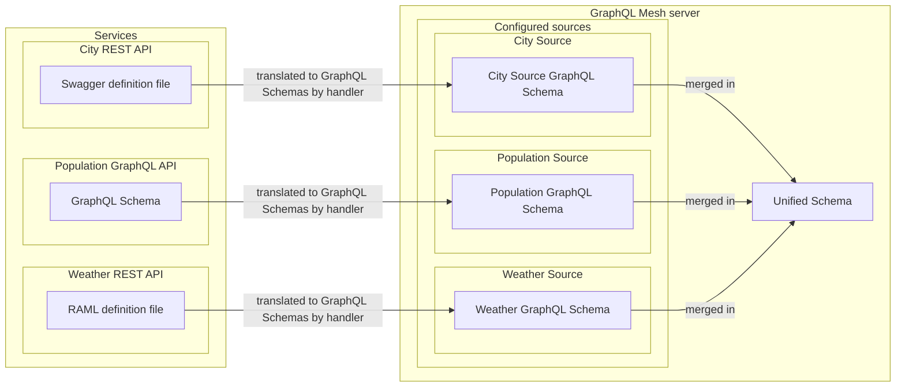

# Overview

Working with Mesh means dealing with 4 main concepts: _Sources_, _Handlers_, _Transforms_ and _Unified Schema_:

1. In Mesh, a sub-service (GraphQL API, REST API) is called a _Source_.
2. Sources are translated to GraphQL Schemas with the appropriate _Handler_.
3. All Sources' GraphQL Schema are merged into a final _Unified Schema_.
4. Finally, if applicable, configured transformations, called _Transforms_, are applied to the _Unified Schema_.

The above GraphQL Mesh Gateway has 3 configured _Sources_:

1. The "City" _Source_ configured with the `@graphql-mesh/openapi` _Handler_.
2. The "Population" _Source_ configured with the `@graphql-mesh/graphql` _Handler_.
3. The "Weather" _Source_ configured with the `@graphql-mesh/raml` _Handler_.

_Sources_, _Handlers_, _Transforms_ are configured in a `.mesh.yaml` (or `.json`, `.js`) configuration file that defines:

- How to fetch the definition of the sub-services (GraphQL API, REST API, and more)
- What transformations should be applied to the unified schema (_optional_)
- The path to the declaration of custom resolvers (_optional_)
- Which cache strategy should be used? (_optional_)
- Which envelop plugins should be loaded and configured at the server level? (_optional_)

Let's have a closer look to a `.mesh.yaml` configuration file by [installing Mesh](/docs/getting-started/installation) and [building our first Gateway](/docs/your-first-mesh-gateway)!
