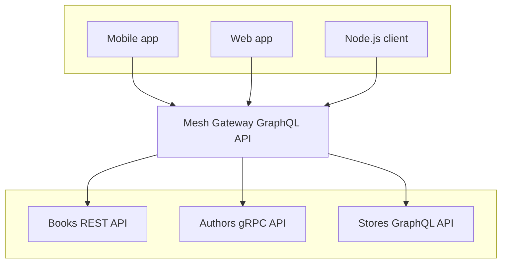
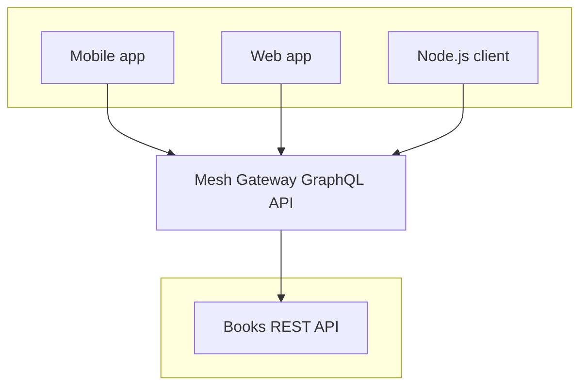

---
description:
  Build your first GraphQL Gateway with Mesh using the Books, Authors, and Stores example APIs in a
  unified schema. Learn how to incorporate the Books REST API into your gateway with Mesh OpenAPI
  handler.
---

# Your first Gateway with Mesh

Mesh [being installed](/docs/getting-started/installation), we can now build our first GraphQL
Gateway.

All the documentation tutorials and guides rely on the "Books", "Authors" and "Stores" example APIs,
available in a dedicated repository:
[`graphql-mesh-docs-first-gateway`](https://github.com/charlypoly/graphql-mesh-docs-first-gateway):

- Books API (REST API)
  - `GET /books`
  - `GET /books/:id`
  - `GET /categories`
- Authors API (gRPC API)
  - `GetAuthor`
  - `ListAuthors`
- Stores (GraphQL API)
  - `stores` Query
  - `bookSells(storeId: ID!)` Query

Our goal is to build a Unified GraphQL Schema through a Mesh Gateway that incorporates our 3 example
services as follows:



In this tutorial, **we will first start by creating a Mesh configuration that incorporates the Books
REST API**, as follows:



Creating the complete Mesh Gateway that combines "Books", "Authors", and "Stores" APIs in a unified
Schema will be covered in the
["Setup a Gateway with many Sources" guide](/docs/guides/combine-many-sources).

## Add the Books REST API to our GraphQL Gateway

### 1. A closer look at our Books REST API

To add the Books API as a _Source_ of our GraphQL Mesh configuration, we will need to get the API's
definition.

Depending on the API type, many definition types will be available; for example, REST API tends to
be described using Open API/Swagger.

Open API is a standard based on JSON Schema (JSON-based files standard) to describe APIs.

Our Books REST API provides an Open API definition file in the following URL:
`http://localhost:3002/openapi.json`.

The `openapi.json` file describes the available endpoints along with their arguments and
responses shape associated with a noperation ID:

- `GET /books` (ID: `AppController_books`)
- `GET /books/:id` (ID: `AppController_book`)
- `GET /categories` (ID: `AppController_categories`)

We now established that our Books API will require the `openapi` Mesh _Handler_ with the
`@graphql-mesh/openapi` package.

### 2. Creating our Mesh configuration file

Let's go to the
[`packages/single-source/`](https://github.com/charlypoly/graphql-mesh-docs-first-gateway/tree/master/packages/single-source)
where the following dependencies are installed:

- `graphql` is a required peer dependency of GraphQL Mesh
- `@graphql-mesh/cli` provides everything to parse the configuration, execute the _Handlers_,
  _Transforms_ and serve the API
- `@graphql-mesh/openapi` is the _Handler_ of the "Books" _Source_

The `.meshrc.yaml` configuration file contains the following content:

```yaml filename=".meshrc.yaml"
sources:
  - name: Books
    handler:
      openapi:
        source: http://localhost:3002/openapi.json
```

The configuration is straightforward; we define a _Source_ called "Books" that is configured with
the `openapi` _Handler_.

By providing the `source` document path, Mesh will be able to translate the OpenAPI JSON definition
to a GraphQL Schema.

**Let's first start our Books API** and **our GraphQL Gateway** by running at the root of the
project:

```sh
yarn start-single-source
```

And open your favorite web browser at [http://0.0.0.0:4000](http://0.0.0.0:4000)

As expected, Mesh translated the Books REST API to a GraphQL Schema, using the following rules:

- a `GET /api/helloWorld` endpoint becomes a Query similar to: `helloWorld(): String!{:graphql}`
- a `POST /api/sayHelloAll` endpoint becomes a Mutation similar to:
  `sayHelloAll(input: [SayHelloAllInput]): String{:graphql}`
- `PUT` and `DELETE` endpoints are also translated to GraphQL Mutations.

This gives us the following Books GraphQL Schema:


You can try out the following Query:

```graphql
{
  AppController_books {
    authorId
    categoryId
    id
    title
  }
}
```

### 3. Shaping the Unified Schema

We might not want to expose all those Queries in our _Unified Schema_. In particular, those Queries
are prefixed with `AppController_` which is not very user-friendly.

Let's say that we want to:

- **remove** the `AppController_` prefix on each Query
- **remove** the `book(id: ID!)` Query
- **rename** the `categories` Query to `booksCategories`.

To achieve such a final Schema design, we will leverage _Transforms_.

#### Remove the `AppController_` prefix

We will start by cleaning up those ugly Query names by removing their prefix.

Let's install the `rename` _Transform_ to rename the Query fields. Loocking at the
[`packages/single-source/`](https://github.com/charlypoly/graphql-mesh-docs-first-gateway/tree/master/packages/single-source)
folder, you will find the following package installed: `@graphql-mesh/transform-rename`.

We can update our
[`.meshrc.yaml`](https://github.com/charlypoly/graphql-mesh-docs-first-gateway/tree/master/packages/single-source/.meshrc.yaml)
as follow:

```yaml filename=".meshrc.yaml" {7-16}
sources:
  - name: Books
    handler:
      openapi:
        source: http://localhost:3002/openapi.json
transforms:
  - rename:
      renames:
        - from:
            type: Query
            field: AppController_(.*)
          to:
            type: Query
            field: $1
          useRegExpForFields: true
```

We added a `transforms` key at the root of the configuration.

`transforms` value is an array of named transforms, ex: `rename`.

`rename` takes a `renames` option that accepts an array of `from`/`to` pairs. Here, we are using a
regexp to capture the end of the Query name, ignoring the `AppController_` prefix.

More information on the `rename` _Transform_ on
[its dedicated documentation page](/docs/transforms/rename).

#### Remove the `book(id: ID!)` Query

We will install and configure the `filterSchema` _Transform_ to remove a Query from the Unified
Schema.

Back to the
[`packages/single-source/`](https://github.com/charlypoly/graphql-mesh-docs-first-gateway/tree/master/packages/single-source)
folder, you will find the following package installed: `@graphql-mesh/transform-filter-schema`.

And update our
[`.meshrc.yaml`](https://github.com/charlypoly/graphql-mesh-docs-first-gateway/tree/master/packages/single-source/.meshrc.yaml)
as follows:

```yaml filename=".meshrc.yaml" {17-20}
sources:
  - name: Books
    handler:
      openapi:
        source: http://localhost:3002/openapi.json
transforms:
  - rename:
      renames:
        - from:
            type: Query
            field: AppController_(.*)
          to:
            type: Query
            field: $1
          useRegExpForFields: true
  - filterSchema:
      filters:
        - Query.!book
```

`filterSchema` takes a `filters` option that accepts an array of filter rules.

By adding `Query.!book`, we instruct Mesh to remove the `book(…)` Query.

More information on the `filterSchema` _Transform_ on
[its dedicated documentation page](/docs/transforms/filter-schema).

#### Rename the `categories(…)` Query to `booksCategories(…)`

Finally, let's rename our `categories(…)` Query to `booksCategories(…)` by using the `rename`
_Transform_ again.

And update our
[`.meshrc.yaml`](https://github.com/charlypoly/graphql-mesh-docs-first-gateway/tree/master/packages/single-source/.meshrc.yaml)
as follows:

```yaml filename=".meshrc.yaml" {20-27}
sources:
  - name: Books
    handler:
      openapi:
        source: http://localhost:3002/openapi.json
transforms:
  - rename:
      renames:
        - from:
            type: Query
            field: AppController_(.*)
          to:
            type: Query
            field: $1
          useRegExpForFields: true
  - filterSchema:
      filters:
        - Query.!book
  - rename:
      renames:
        - from:
            type: Query
            field: categories
          to:
            type: Query
            field: booksCategories
```

#### Our final Unified Schema

Our final _Unified Schema_ is now ready to be used:


The power of GraphQL Mesh, on top of providing an extensive range of _Handlers_, is to empower us to
create well-designed GraphQL Schema using _Transforms_.

Keep in mind that a good GraphQL Schema design should:

- provides useful queries (not expose unnecessary ones)
- simplify the usage by providing the proper abstractions (ex: proper naming and hierarchy)
- provide specialized mutations that represent specific behaviors instead of CRUD mutations directly
  linked to an underlying data-schema

### Our GraphQL Gateway API is ready!

Congratulations! Our Books REST API is now accessible through our Mesh GraphQL Gateway a
comprehensive and tailored Schema design.

You can now start again and play with the GraphQL Schema by running:

```sh
yarn start-single-source
```

And open your favorite web browser at [http://0.0.0.0:4000](http://0.0.0.0:4000) and try the
following Query:

```graphql
{
  books {
    id
    title
    categoryId
  }
  booksCategories {
    id
    name
  }
}
```

## Going further

You are now familiar with Mesh's concepts of _Sources_, _Handlers_, _Transforms_, and _Unified
Schema_ 🚀.

Let's finish our Gateway in the
["Combine multiple Sources" guide](/docs/getting-started/combine-multiple-sources).
