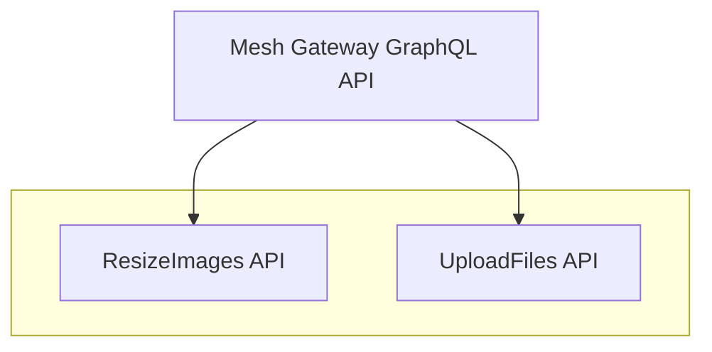

# File uploads

Thanks to its server based on [GraphQL Yoga](https://graphql-yoga.com), GraphQL Mesh provides file upload support out of the box.

Similarly, just a few configuration changes will be necessary to forward file uploads to Sources.

## Sources file uploads

The following Gateway integrates a "UploadFiles" Source that has file upload capabilities:



To support forwarding file uploads to the "UploadFiles" Source, we will need to add the `maxRequestBodySize` to the `serve` configuration:

[`.meshrc.yaml`](https://github.com/Urigo/graphql-mesh/tree/master/examples/graphql-file-upload-example/.meshrc.yml)

```yaml filename=".meshrc.yaml"
# …

serve:
  maxRequestBodySize: 10mb
```

You will find the complete example in [`examples/graphql-file-upload-example/.meshrc.yml`](https://github.com/Urigo/graphql-mesh/tree/master/examples/graphql-file-upload-example/.meshrc.yml).

## Custom resolvers file uploads

Custom resolvers, programmatically provided by `additionalResolvers`, can also support File uploads (ex: upload to S3).

For this, the only configuration step would be to define the `File` scalar to enable file uploads and our file upload Mutation:

```yaml filename=".meshrc.yaml"
sources:
  # …
transforms:
  # …
additionalTypeDefs: |
  scalar Upload

  extend type Mutation {
    uploadFile(upload: Upload!): File!
  }

additionalResolvers:
  - './resolvers'
```

Then the resolvers would look as follows:

```ts filename="resolvers.ts"
import { Resolvers } from './.mesh'

const resolvers: Resolvers = {
  Mutation: {
    async uploadFile(_, { upload }) {
      const filename = upload.name
      const arrayBuffer = await upload.arrayBuffer()
      const buffer = Buffer.from(arrayBuffer)

      // upload file to S3...

      return { filename }
    }
  }
}

export default resolvers
```
