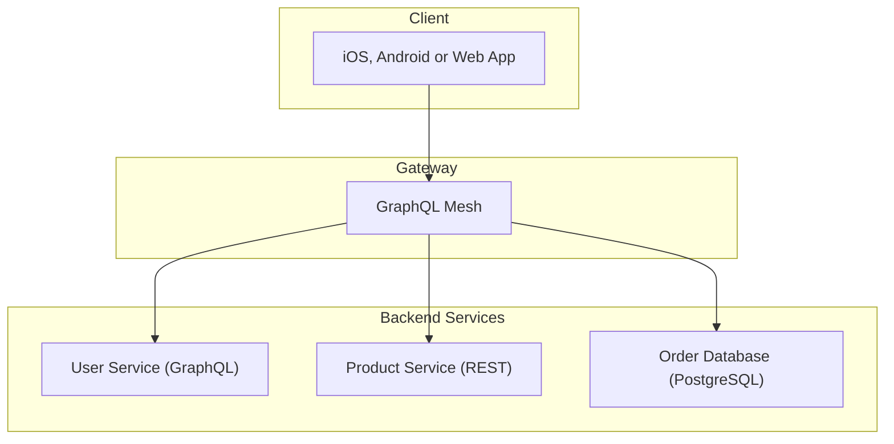

---
description:
  GraphQL Mesh is a framework that allows you to build GraphQL gateways using GraphQL or non-GraphQL
  sources
---

import { Callout, Cards } from '@theguild/components'

# Introduction

Mesh is a GraphQL composition framework and gateway for both GraphQL Federation and non-GraphQL
Federation subgraphs, non-GraphQL services, such as REST and gRPC, and also databases such as
MongoDB, MySQL, and PostgreSQL.

The GraphQL Mesh framework consists of two main components.

**Mesh Compose.** Combine muliple API sources (GraphQL, Federation, REST, gRPC, PostgreSQL, MySql
and co) into a single GraphQL supegraph.

**Mesh Serve.** The Gateway to serve your existing supergraph as provided by either Mesh Compose,
GraphQL Hive, Apollo GraphOS, or a proxy to your existing GraphQL API. Flexible support for
authentication, authorization, caching, rate-limiting and observability.

### Next steps

Want to turn existing services into a GraphQL supergraph? Continue with Mesh Compose.

Already have a supergraph from a schema registry such as GraphQL Hive or Apollo GraphOS and want to
spin up a gateway? Continue with Mesh Serve.

<Cards>
  <Cards.Card arrow title="Get Started with Mesh Compose" href="/v1/compose" />
  <Cards.Card arrow title="Get Started with Mesh Serve" href="/v1/serve" />

</Cards>
