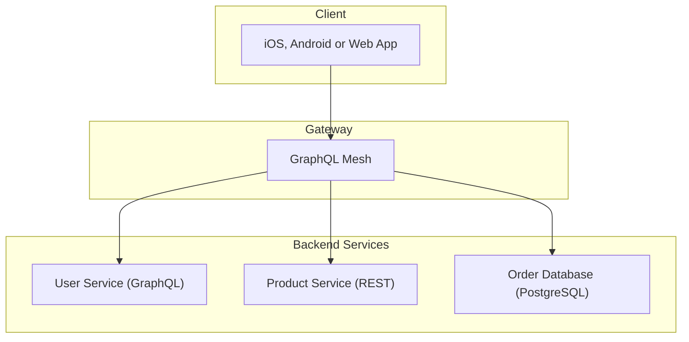

---
description:
  GraphQL Mesh is a framework that allows you to build GraphQL gateways using GraphQL or non-GraphQL
  sources
---

import { Callout, Cards } from '@theguild/components'

# Introduction

Mesh is a GraphQL composition framework and gateway for both GraphQL Federation and non-GraphQL
Federation subgraphs, non-GraphQL services, such as REST and gRPC, and also databases such as
MongoDB, MySQL, and PostgreSQL.

The GraphQL Mesh framework consists of two main components.

**Mesh Compose.** Combine muliple API sources (GraphQL, Federation, REST, gRPC, PostgreSQL, MySql
and co) into a single GraphQL supegraph.

**Mesh Serve.** The Gateway to serve your existing supergraph as provided by either Mesh Compose,
GraphQL Hive, Apollo GraphOS, or a proxy to your existing GraphQL API. Flexible support for
authentication, authorization, caching, rate-limiting and observability.

### Get Started with Compose

<Cards>
  <Cards.Card arrow title="Combine GraphQL and non-GraphQL sources" href="/v1/compose" />
</Cards>

### Get Started with Serve

<Cards>
  <Cards.Card
    arrow
    title="Serve a Supergraph from GraphQL Hive"
    href="/v1/serve/schema-registry/hive"
  />
  <Cards.Card
    arrow
    title="Serve a Supergraph from Apollo GraphOS"
    href="/v1/serve/schema-registry/graphos"
  />
  <Cards.Card
    arrow
    title="Proxy to an existing GraphQL API"
    href="/v1/serve#configure-mesh-as-a-graphql-proxy"
  />
</Cards>
