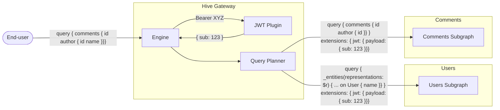

import { Callout } from '@theguild/components'

# JSON Web Tokens (JWT)

A [JSON Web Tokens (JWT)](https://jwt.io/) is a signed token containing arbitrary informations,
commonly used for authentication. By being signed by the issuer of the token, it can be verified
that the token is valid and has not been tampered with.

Hive Gateway provides a plugin to easily integrate JWT into your API, allowing you to easily
validate, decode and use the token (for identity and authorization).

Once you have the JWT token extract and validated, the JWT claims (and optionally, the full token)
are injected to the Hive Gateway execution context, and forwarded to upstream GraphQL subgraphs,
using the `extensions` field.

<Callout type="warning">

When JWT is enabled and claims are forwarded to the upstream GraphQL subgraphs, you might want to
use [HMAC Signature](/v1/serve/features/security/hmac-signature) between your Hive Gateway and the
subgraphs. This will ensure that the requests to the subgraphs are trusted and signed by the
gateway, and no other entity can execute requests to the subgraph on behalf of the end-users.

</Callout>

## How to use?

Here's a mininal example for configuring the JWT plugin with a local signing key, and looking for
the token in the `authorization` header:

```ts filename="gateway.config.ts"
import {
  createInlineSigningKeyProvider,
  defineConfig,
  extractFromHeader
} from '@graphql-hive/gateway'

const signingKey = 'my-secret-key'

export const gatewayConfig = defineConfig({
  jwt: {
    // Look and extract for the token in the 'authorization' header, with the 'Bearer' prefix.
    lookupLocations: [extractFromHeader({ name: 'authorization', prefix: 'Bearer' })],
    // Decode and validate the token using the provided signing key.
    singingKeyProviders: [createInlineSigningKeyProvider(signingKey)],
    // Forward the verified token payload to the upstream GraphQL subgraphs.
    forwared: {
      payload: true
    }
  }
})
```

You can also pass
[additional configuration options to the Yoga plugin](https://the-guild.dev/graphql/yoga-server/docs/features/jwt#additional-configuration):

```ts filename="gateway.config.ts"
import { defineConfig, createInlineSigningKeyProvider, createRemoteJwksSigningKeyProvider, extractFromHeader, extractFromCookie } from '@graphql-hive/gateway'

export const gatewayConfig = defineConfig({
  jwt: {
      // Forward the extracted token and claims to the upstream GraphQL subgraphs.
      forwarded: {
        payload: true, // optional, defualt is "true"
        token: false, // optional, defualt is "false"
        extensionsFieldName: "jwt", // optional, defualt is "jwt"
      },
      // Configure your signing providers: either a local signing-key or a remote JWKS are supported.
      singingKeyProviders: [
        createInlineSigningKeyProvider(signingKey),
        createRemoteJwksSigningKeyProvider({ jwksUri: 'https://example.com/.well-known/jwks.json' })
      ]
      // Configure where to look for the JWT token: in the headers, or cookies.
      // By default, the plugin will look for the token in the 'authorization' header only.
      lookupLocations: [
        extractFromHeader({ name: 'authorization', prefix: 'Bearer' }),
        extractFromCookie({ name: 'auth' }),
      ],
      // Configure your token issuers/audience/algorithms verification options.
      // By default, the plugin will only verify the HS256/RS256 algorithms.
      // Please note that this should match the JWT signer issuer/audience/algorithms.
      tokenVerification: {
        issuer: 'http://my-issuer.com',
        audience: 'my-audience',
        algorithms: ['HS256', 'RS256'],
      },
      // The plugin can reject the request if the token is missing or invalid (doesn't pass JWT `verify` flow).
      // By default, the plugin will reject the request if the token is missing or invalid.
      reject: {
        missingToken: true,
        invalidToken: true,
      }
  }
})
```

## Configuration Options

Please refer to the
[configuration options of the Yoga plugin](https://the-guild.dev/graphql/yoga-server/docs/features/jwt#additional-configuration)
for complete details and examples.

## Forwarding the JWT token and payload

The JWT token and payload can be forwarded to the upstream GraphQL subgraphs, using the `extensions`
field of the request body.

This workflow can allow you to easily delegate the authentication process to Hive Gateway, and allow
the subgraphs to deal only with the user identity and authorization.



To pass the full token payload, you can use the `forwarded.claims` option:

```ts
{
  forwarded: {
    payload: true // optional, defualt is "true"
  }
}
```

The token payload will be injected into `extensions.jwt.payload` of the upstream request body:

```json
{
  "query": "{ comments { id author { id }} }",
  "extensions": {
    "jwt": {
      "payload": {
        "sub": 123
      }
    }
  }
}
```

You can also pass the full token, using the `forwared.token` option:

```ts
{
  forwared: {
    payload: true, // optional, defualt is "true"
    token: true // optional, defualt is "false"
  }
}
```

And the token and (optional) prefix will be injected into `extensions.jwt.token` of the upstream
HTTP request:

```json
{
  "query": "{ comments { id author { id }} }",
  "extensions": {
    "jwt": {
      "payload": {
        "sub": 123
      },
      "token": {
        "value": "XYZ",
        "prefix": "Bearer"
      }
    }
  }
}
```

Additionally, if you wish to change the name of the `jwt` field in the extensions, you can use the
`forwarded.extensionsFieldName` option to change it:

```ts
{
  forwarded: {
    extensionsFieldName: 'myJwt' // optional, defualt is "jwt"
  }
}
```

## Using the JWT token

### Within Gateway

The JWT plugin will inject the decoded token and payload into the context of Hive Gateway.

You can use the injected payload with other plugins, to implement things like authorization or
user-identity based logic.

For example, with a plugin like
[Operation Field Permissions](/v1/serve/features/security/auth/operation-field-permissions), you can
use the `jwt` property of the context to access the decoded JWT token, and decide what permissions
to allow to the user based on identity or token claims:

```ts filename="gateway.config.ts"
import { useOperationFieldPermissions } from '@envelop/operation-field-permissions'
import { defineConfig } from '@graphql-hive/gateway'

export const gatewayConfig = defineConfig({
  // ...
  jwt: {
    // ...
  },
  plugins: () => [
    useOperationFieldPermissions({
      getPermissions: async context => {
        const { jwt } = context

        // Check based on identity / user-id.
        if (jwt?.payload?.sub === '123') {
          return new Set(['Query.*'])
        }

        // Check based on token payload
        if (jwt?.payload?.role === 'admin') {
          return new Set(['Query.*'])
        }

        // Default permissions
        return new Set(['Query.greetings'])
      }
    })
  ]
})
```

### In upstream GraphQL subgraphs

#### GraphQL-Yoga

The JWT token and claims are forwarded to the upstream GraphQL subgraphs, using the `extensions`
field.

To access the JWT token and claims in your upstream service resolvers/execution, you can use the
`extensions` field of the incoming GraphQL request.

If you are using [GraphQL-Yoga](the-guild.dev/graphql/yoga-server) for your upstream subgraph
implementation, you can use a built-in utility for extracting it for you in an easy way:

```ts filename="yoga-subgraph.ts"
import { useForwardedJWT } from '@graphql-hive/gateway'

const myYogaSubgraphServer = createYoga({
  schema: mySchema,
  plugins: [
    useForwardedJWT({
      // The name of the field in the extensions object, default is "jwt"
      extensionsFieldName: 'jwt',
      // The name of the field to inject into the local context object, default is "jwt"
      extendContextFieldName: 'jwt'
    })
  ]
})
```

With this plugin configured, you should be able to just access `context.jwt` in your subgraphs, just
like you would in the gateway.

This makes the process of integrating JWT easier, and streamlined across the whole flow of
execution.

#### Apollo Server

With Apollo-Server, you can access the forwarded claims/token, using a custom Apollo-Server plugin
that extracts `extensions` and injects it into the context:

```ts filename="apollo-subgraph.ts"
import { ApolloServer, ApolloServerPlugin } from '@apollo/server'

const extractJwtPlugin = {
  async requestDidStart({ request, contextValue }) {
    contextValue.jwt = request.extensions?.jwt
  }
} satisfies ApolloServerPlugin<{ jwt?: { payload: Record<string, any> } }>

const server = new ApolloServer({
  // Now, in your schema resolvers, you can access the JWT token and claims using `context.jwt`.
  plugins: [extractJwtPlugin]
  // ...
})
```

#### Other GraphQL servers

Other implementations for GraphQL subgraph servers can also access the JWT token and claims, by
looking at the `extensions` field of the incoming request.

The `extensions` field of the incoming request will contain the JWT token and claims, injected by
Hive Gateway, following this structure:

```json
{
  "extensions": {
    "jwt": {
      "payload": {
        "sub": 123
      },
      // optional, depends on the gateway plugin configuration
      "token": {
        "value": "XYZ",
        "prefix": "Bearer"
      }
    }
  }
}
```

## Additional Configuration

### Token lookup

The plugin can be configured to look for the JWT token in different locations:

#### HTTP Header

By default, the plugin will look for the token in the `authorization` header. You can configure the
plugin to look for the token in a different header or with a different prefix.

The prefix is being validated along with the token (for example: `Bearer my-token`).

```ts
import { defineConfig, extractFromHeader } from '@graphql-hive/gateway'

export const gatewayConfig = defineConfig({
  // ...
  jwt: {
    // ...
    lookupLocations: [extractFromHeader({ name: 'x-auth-token', prefix: 'Bearer' })]
  }
})
```

#### HTTP Cookie

You can configure the plugin to look for the token in a cookie. To do so, you need to enable cookie
parsing in the gateway.

```ts
import { extractFromCookie, defineConfig } from '@graphql-hive/gateway'

export const gatewayConfig = defineConfig({
  // ...
  jwt: {
    // ...
    lookupLocations: [extractFromCookie({ name: 'my-cookie' })]
  }
  // Make sure you enabled cookie parsing in the gateway
  cookies: true,
})
```

#### Custom Function

You can configure the plugin to use a custom function to look for the token:

```ts
import { defineConfig } from '@graphql-hive/gateway'

const getToken = ({ request, serverContext, url }) => {
  return request.headers.get('x-my-token')
}

export const gatewayConfig = defineConfig({
  // ...
  jwt: {
    // ...
    lookupLocations: [getToken]
  }
})
```

#### Multiple locations

You can configure the plugin to look for the token in multiple locations. The plugin will look for
the token in the order you provide.

```ts
import { defineConfig, extractFromCookie, extractFromHeader } from '@graphql-hive/gateway'

export const gatewayConfig = defineConfig({
  // ...
  jwt: {
    // ...
    lookupLocations: [
      extractFromHeader({ name: 'authorization', prefix: 'Bearer' }),
      extractFromHeader({ name: 'x-legacy-auth' }),
      extractFromHeader({ name: 'x-api-key', prefix: 'API-Access' }),
      extractFromCookie({ name: 'browserAuth' })
    ]
  }
})
```

---

### Signing Key providers

The plugin can be configured to use different signing key providers:

#### Inline

You can provide the signing key directly in the configuration.

> Do not hardcode the signing key in your code. Use environment variables, local encrypted file or a
> secret store!

```ts
import { createInlineSigningKeyProvider, defineConfig } from '@graphql-hive/gateway'

export const gatewayConfig = defineConfig({
  // ...
  jwt: {
    // ...
    singingKeyProviders: [createInlineSigningKeyProvider(process.env.MY_JWT_SECRET)]
  }
})
```

> In case you are using an inline signing key provider, all `keyid` / `kid` will be allowed in
> tokens.

#### Remote JWKS

You can configure the plugin to fetch the signing key from a remote JWKS endpoint.

Provide a `jwksClientOptions` object (see
[node-jwks-rsa documentation](https://github.com/auth0/node-jwks-rsa/blob/master/EXAMPLES.md)].

```ts
import { createRemoteJwksSigningKeyProvider, defineConfig } from '@graphql-hive/gateway'

export const gatewayConfig = defineConfig({
  // ...
  jwt: {
    // ...
    singingKeyProviders: [
      createRemoteJwksSigningKeyProvider({
        jwksUri: 'https://example.com/.well-known/jwks.json'
      })
    ]
  }
})
```

#### Multiple providers

When using multiple providers, the plugin will try to use the first available signing key.

```ts
import {
  createInlineSigningKeyProvider,
  createRemoteJwksSigningKeyProvider,
  defineConfig
} from '@graphql-hive/gateway'

export const gatewayConfig = defineConfig({
  // ...
  jwt: {
    // ...
    singingKeyProviders: [
      // In case your remote provider is not available, the plugin will try use the inline provider.
      createRemoteJwksSigningKeyProvider({
        jwksUri: 'https://example.com/.well-known/jwks.json'
      }),
      createInlineSigningKeyProvider(process.env.MY_JWT_SECRET)
    ]
  }
})
```

---

### Token Verification

The plugin verification process can be customized to match the JWT token `issuer`, `audience`, and
algorithms.

> Note that the verification options should match the JWT signer's configuration.

You can find
[here the complete list of verification options](https://github.com/DefinitelyTyped/DefinitelyTyped/blob/master/types/jsonwebtoken/index.d.ts#L58-L77)
for this plugin.

```ts
import { defineConfig } from '@graphql-hive/gateway'

export const gatewayConfig = defineConfig({
  // ...
  jwt: {
    // ...
    tokenVerification: {
      issuer: ['http://yoga'],
      audience: 'my-audience',
      algorithms: ['HS256', 'RS256']
    }
  }
})
```

### Execution Rejection

The plugin can be configured to reject the request if the token is missing or invalid.

By default, an authentication error will be thrown if the token is missing or invalid, and the
request will be reject with status code `401`.

```ts
import { defineConfig } from '@graphql-hive/gateway'

export const gatewayConfig = defineConfig({
  // ...
  jwt: {
    // ...
    reject: {
      missingToken: true,
      invalidToken: true
    }
  }
})
```

> In case you want to handle the error yourself, you can set
> `reject: { missingToken: false, invalidToken: false }` and handle the error in your resolvers. The
> `context.jwt` will be `undefined` in case of missing or invalid token.

### Granular Protection optionally with Auth Directives (`@authenticated`, `@requiresScopes` and `@policy`)

By default, the JWT plugin protects the whole schema. If you want to use a granular protection by
using Federation directives such as `@authenticated`, `@requiresScopes` and `@policy`, you can use
[Generic Auth plugin](/v1/serve/features/auth/generic-auth) to have a granular protection using with
or without JWT.

With the following configuration, you can use the JWT plugin to extract the token and claims, and
then use the Generic Auth plugin to protect the schema with the Federation directives:

```ts
import { defineConfig } from '@graphql-hive/gateway'

export const gatewayConfig = defineConfig({
  // ...
  jwt: {
    // You have to disable the default rejection of the JWT plugin
    reject: {
      missingToken: false,
      invalidToken: false
    }
  },
  genericAuth: {
    // Then set generic auth plugin to use granular mode
    mode: 'protect-granular',
    // Set where to extract the payload
    resolveUser: ctx => ctx.jwt?.payload,
    // If you want to continue execution even if some fields are rejected
    rejectUnauthenticated: false
  }
})
```

[Learn more about granular protection of Generic Auth plugin](/v1/serve/features/auth/generic-auth)
