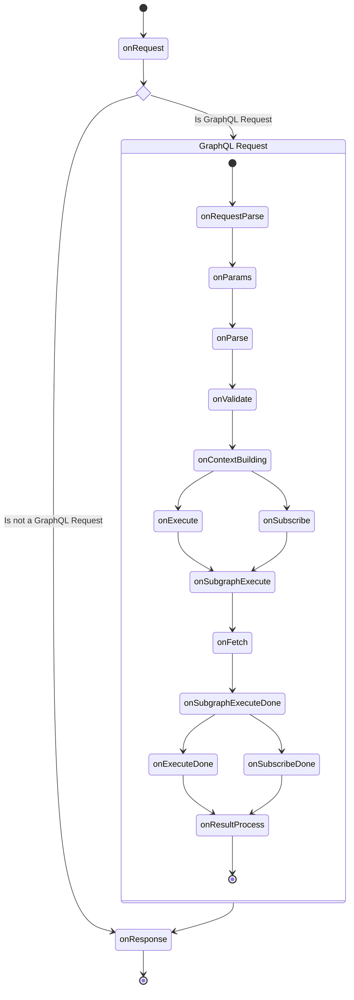

import { Callout } from '@theguild/components'

# Custom Plugins

<Callout>
  This page is currently under construction and expected to change. Please feel free to reach out to
  us directly in case you are having any troubles.
</Callout>

Hive Gateway uses
[GraphQL Yoga](https://the-guild.dev/graphql/yoga-server/docs/features/envelop-plugins), and it uses
[Envelop](https://the-guild.dev/graphql/envelop) plugin system which allows you to hook into the
different phases of the GraphQL execution to manipulate or track the entire workflow step-by-step.

<Callout>
You can both use Yoga or Envelop or Gateway plugins with your GraphQL Gateway.
But you should always opt-in for the Hive Gateway variant of the plugin, then Yoga then Envelop because each of them have more control over the execution.
For example, Yoga variant of the plugin leverage HTTP hooks, and Hive Gateway one can leverage more hooks and more control over the context.

We'd recommend to check the features of the gateway first, and if you can't find what you are
looking for, then you can use this option on your own to add plugins from either GraphQL Yoga or
[Envelop's Plugin Hub](https://the-guild.dev/graphql/envelop/plugins).

</Callout>

You can provide those plugins as an array of objects,

```ts filename="gateway.config.ts" {7}
import { useGraphQLJit } from '@envelop/graphql-jit'
import { defineConfig } from '@graphql-hive/gateway'

export const gatewayConfig = defineConfig({
  plugins: () => [useGraphQLJit()]
})
```

## Writing Plugins

Sometimes you might want to build your own plugins. You can write your own gateway plugin and even
share it with other people by publishing it to `npm`.

<Callout>
  A good entry-point for discovering how to write Gateway plugins is to look at the source code of
  the existing plugins maintained by us.
</Callout>

The most hooks for Hive Gateway origin from the Envelop and Yoga plugin systems.
[Please refer to the Envelop Plugin Lifecycle documentation for more information.](https://the-guild.dev/graphql/envelop/docs/plugins/lifecycle)
and
[Yoga Plugin Lifecycle documentation](https://the-guild.dev/graphql/yoga-server/docs/features/envelop-plugins).
In addition, Yoga adds more HTTP specific hooks while Hive Gateway adds more related to the subgraph
execution. Gateway plugins also uses
[Explicit Resource Management](https://www.typescriptlang.org/docs/handbook/release-notes/typescript-5-2.html),
so all the resources are cleaned up gracefully when Hive Gateway is shut down. You can see
`Symbol.asyncDispose` below.

### Plugin Lifecycle

The following diagram shows the plugin lifecycle of Hive Gateway. For a detailed description of each
hook, please refer to the detail sections of each hook. Please check Yoga and Envelop documentation
for more information about the hooks except `onSubgraphExecute`.



#### `onSubgraphExecute`

This hook is invoked for ANY request that is sent to the subgraph.

**Example actions in this hook:**

- Manipulate the request
- Add a custom auth header
- Monitor the subgraph request

You can see [Prometheus plugin](/v1/serve/plugins/monitoring-tracing/prometheus) for an example of
how to use this hook.

#### `onFetch`

This hook is invoked everytime the gateways sends an outgoing HTTP request to an upstream service.

**Example actions in this hook:**

- Manipulate HTTP [`Request`](https://developer.mozilla.org/en-US/docs/Web/API/Request) object
- Manipulate HTTP [`Response`](https://developer.mozilla.org/en-US/docs/Web/API/Response) object
- Change [`fetch`](https://developer.mozilla.org/en-US/docs/Web/API/Fetch_API) implementation
- Add custom headers
- Monitor the HTTP request

**Example plugins:**

- [Prometheus plugin](/v1/serve/plugins/monitoring-tracing/prometheus)

##### `API`

- `supergraph`: The unified graph
- `subgraph`: The subgraph
- `subgraphName`: The name of the subgraph
- `transportEntry`: The transport entry for the subgraph including the configuration for the
  upstream communication, and details.
- `executionRequest`: The execution request object that is sent to the subgraph, that includes
  `document`, `variables`, `contextValue`, `operationName`, and etc.
- `setExecutionRequest`: A function to replace the execution request object that will be sent to the
  subgraph.
- `executor`: The executor function that will be used to execute the request to the subgraph, and it
  takes the execution request object.
- `setExecutor`: A function to replace the executor function
- `logger`: The logger instance for the specific request that includes the details of the request
  and the response.

#### `Symbol.asyncDispose` or `Symbol.dispose`

In order to clean up resources when Hive Gateway is shut down, you can use `Symbol.asyncDispose` or
`Symbol.syncDispose` to clean up resources.

```ts
export const useMyPlugin = () => {
  return {
    async [Symbol.asyncDispose]() {
      // Clean up resources
      stopConnection()
    }
  }
}
```

You can learn more about
[Explicit Resource Management](https://www.typescriptlang.org/docs/handbook/release-notes/typescript-5-2.html#using-declarations-and-explicit-resource-management)
here.

### Plugin Context

Hive Gateway comes with ready-to-use `logger`, `fetch`, cache storage and etc that are shared across
different components. We'd highly recommend you to use those available context values instead of
creating your own for a specific plugin.

```ts filename="gateway.config.ts"
import { defineConfig } from '@graphql-hive/gateway'

export const gatewayConfig = defineConfig({
  plugins({
    fetch, // WHATWG compatible Fetch implementation.
    logger, // Logger instance used by Hive Gateway
    cwd, // Current working directory
    pubsub, // PubSub instance used by Hive Gateway
    cache // Cache storage used by Hive Gateway
  }) {
    return [
      useMyPlugin({ logger, fetch }) // So the plugin can use the shared logger and fetch
    ]
  }
})
```

## Example Additional Plugin ( SOFA )

GraphQL SOFA allows you to generate a fully documented REST API from your GraphQL schema. This is
useful when you need to support REST clients or when you want to expose a REST API to the public.

- **Don’t choose between REST and GraphQL**
- Get most of the **benefits of GraphQL** on the backend and frontend, while using and **exposing
  REST**
- **Support all your existing clients** with REST while improving your backend stack with GraphQL
- Create custom, perfectly client-aligned REST endpoints for your frontend simply by naming a route
  and attaching a query
- In the other way around (REST to GraphQL) you won’t get the best of both worlds. Instead just less
  powerful, harder-to-maintain server implementations with a some of the benefits of GraphQL. It can
  be a good and fast start for a migration though.
- Fully **generated documentation** that is always up-to-date
- **GraphQL Subscriptions as Webhooks**

## Installation

```sh npm2yarn
npm i @graphql-yoga/plugin-sofa
```

## Quick Start

```ts filename="gateway.config.ts"
import { defineConfig } from '@graphql-hive/gateway'
import { useSOFA } from '@graphql-yoga/plugin-sofa'

export const gatewayConfig = defineConfig({
  plugins: pluginCtx => [
    useSOFA({
      // The path where the REST API will be served
      basePath: '/rest',
      // The path where the Swagger UI will be served
      swaggerUIEndpoint: '/rest/docs',
      // OpenAPI Document details
      info: {
        title: 'My API',
        description: 'My API Description',
        version: '1.0.0'
      }
    })
  ]
})
```

[Learn more about SOFA](https://the-guild.dev/graphql/sofa-api/docs)

<Callout>
  You can consume the API using [feTS Client](https://the-guild.dev/openapi/fets/client/quick-start)
  without any code generation!
</Callout>
