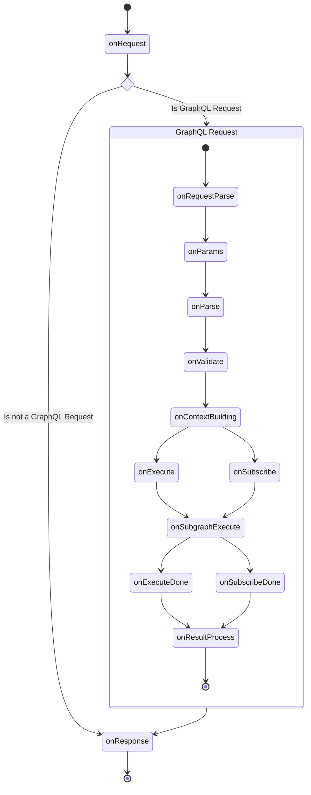

import { Callout } from '@theguild/components'

# Custom Plugins

GraphQL Mesh uses
[GraphQL Yoga](https://the-guild.dev/graphql/yoga-server/docs/features/envelop-plugins), and it uses
[Envelop](https://the-guild.dev/graphql/envelop) plugin system which allows you to hook into the
different phases of the GraphQL execution to manipulate or track the entire workflow step-by-step.

<Callout>
You can both use Yoga or Envelop or Mesh plugins with GraphQL Mesh.
But you should always opt-in for the Mesh variant of the plugin, then Yoga then Envelop because each of them have more control over the execution.
For example, Yoga variant of the plugin leverage HTTP hooks, and Mesh one can leverage more hooks and more control over the context.

We'd recommend to check the features of GraphQL Mesh first, and if you can't find what you are
looking for, then you can use this option on your own to add plugins from either GraphQL Yoga or
[Envelop's Plugin Hub](https://the-guild.dev/graphql/envelop/plugins).

</Callout>

You can provide those plugins as an array of objects,

```ts filename="mesh.config.ts" {7}
import { useGraphQLJit } from '@envelop/graphql-jit'
import { defineConfig as defineServeConfig } from '@graphql-mesh/serve-cli'
// or a Yoga Plugin
import { useCSRFPrevention } from '@graphql-yoga/plugin-csrf-prevention'

export const serveConfig = defineServeConfig({
  plugins: () => [useGraphQLJit(), useCSRFPrevention()]
})
```

## Writing Plugins

Sometimes you might want to build your own plugins. You can write your own Mesh plugin and even
share it with other people by publishing it to `npm`.

<Callout>
  A good entry-point for discovering how to write Mesh plugins is to look at the source code of the
  existing plugins maintained by us.
</Callout>

The most hooks for Mesh origin from the Envelop and Yoga plugin systems.
[Please refer to the Envelop Plugin Lifecycle documentation for more information.](https://the-guild.dev/graphql/envelop/docs/plugins/lifecycle)
and
[Yoga Plugin Lifecycle documentation](https://the-guild.dev/graphql/yoga-server/docs/features/envelop-plugins).
In addition, Yoga adds more HTTP specific hooks while Mesh adds more related to the subgraph
execution. GraphQL Mesh plugins also uses
[Explicit Resource Management](https://www.typescriptlang.org/docs/handbook/release-notes/typescript-5-2.html),
so all the resources are cleaned up gracefully when Mesh gateway is shut down. You can see
`Symbol.asyncDispose` below.

### Plugin Lifecycle

The following diagram shows the plugin lifecycle of GraphQL Mesh. For a detailed description of each
hook, please refer to the detail sections of each hook. Please check Yoga and Envelop documentation
for more information about the hooks except `onSubgraphExecute`.



#### `onSubgraphExecute`

This hook is invoked for ANY request that is sent to the subgraph.

**Example actions in this hook:**

- Manipulate the request
- Add a custom auth header
- Monitor the subgraph request

You can see [Prometheus plugin](/v1/serve/plugins/monitoring-tracing/prometheus) for an example of
how to use this hook.

##### `API`

- `fusiongraph`: The unified graph
- `subgraph`: The subgraph
- `subgraphName`: The name of the subgraph
- `transportEntry`: The transport entry for the subgraph including the configuration for the
  upstream communication, and details.
- `executionRequest`: The execution request object that is sent to the subgraph, that includes
  `document`, `variables`, `contextValue`, `operationName`, and etc.
- `setExecutionRequest`: A function to replace the execution request object that will be sent to the
  subgraph.
- `executor`: The executor function that will be used to execute the request to the subgraph, and it
  takes the execution request object.
- `setExecutor`: A function to replace the executor function

#### `Symbol.asyncDispose` or `Symbol.dispose`

In order to clean up resources when the Mesh gateway is shut down, you can use `Symbol.asyncDispose`
or `Symbol.syncDispose` to clean up resources.

```ts
export const useMyPlugin = () => {
  return {
    async [Symbol.asyncDispose]() {
      // Clean up resources
      stopConnection()
    }
  }
}
```

You can learn more about
[Explicit Resource Management](https://www.typescriptlang.org/docs/handbook/release-notes/typescript-5-2.html#using-declarations-and-explicit-resource-management)
here.

### Plugin Context

GraphQL Mesh comes with ready-to-use `logger`, `fetch`, cache storage and etc that are shared across
different components. We'd highly recommend you to use those available context values instead of
creating your own for a specific plugin.

```ts filename="mesh.config.ts"
import { defineConfig as defineServeConfig } from '@graphql-mesh/serve-cli'

export const serveConfig = defineServeConfig({
  plugins({
    fetch, // WHATWG compatible Fetch implementation.
    logger, // Logger instance used by Mesh
    cwd, // Current working directory
    pubsub, // PubSub instance used by Mesh
    cache // Cache storage used by Mesh
  }) {
    return [
      useMyPlugin({ logger, fetch }) // So the plugin can use the shared logger and fetch
    ]
  }
})
```
