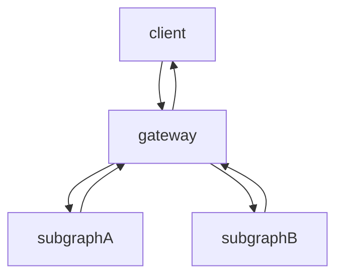
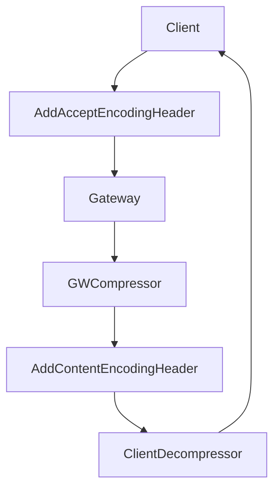
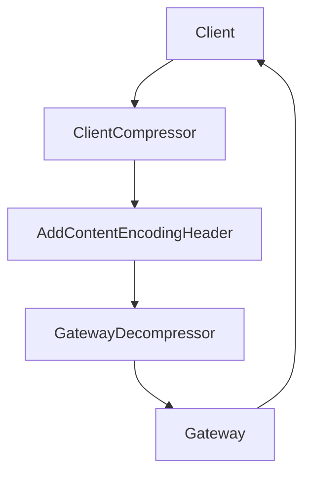
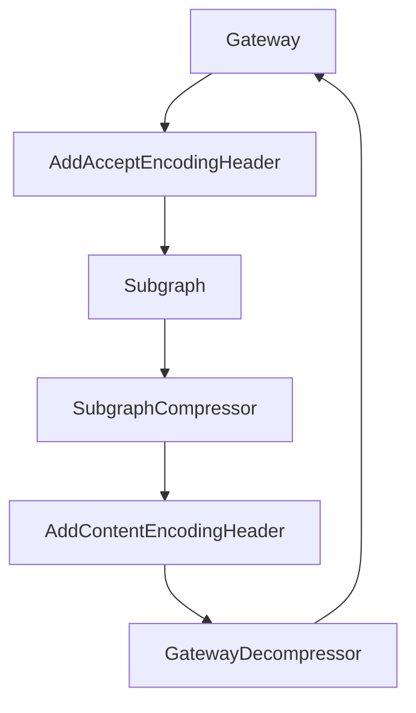
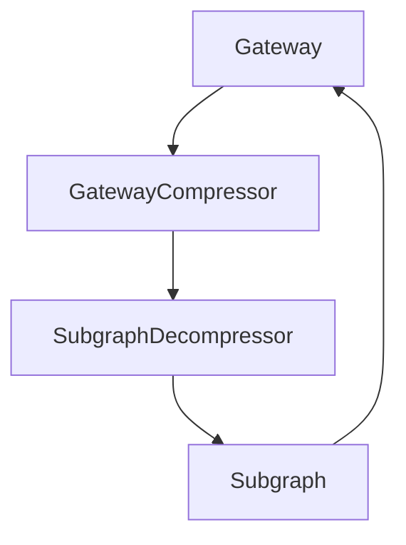

# Compression in HTTP

import { Callout } from '@theguild/components'

Compression is a technique used to reduce the size of the data that is being transferred between the
server and the client. This is done by compressing the data before sending it and then decompressing
it on the client side. This can help reduce the amount of data that needs to be transferred, which
can improve the performance of your website.

`Content-Encoding` and `Accept-Encoding` HTTP headers are used for this behavior. The
`Content-Encoding` header is used to specify the compression algorithm that was used to compress the
data, while the `Accept-Encoding` header is used to specify the compression algorithms that the
client supports.

[Learn more about compression in HTTP](https://developer.mozilla.org/en-US/docs/Web/HTTP/Headers/Content-Encoding)

Hive Gateway is capable of handling compressions in the following directions. We can selectively
enable or disable compression in each direction.



<Callout>
  <b>Caution!</b>
  <br />
  Please take a look at the each direction, because even if they look similar, they have different
  configurations and behaviors. While configuring the compression, make sure each side supports the
  compression algorithm that the other side supports. Otherwise, it will end up with unexpected
  errors.
</Callout>

## From the gateway to the client

When the client sends a request to the gateway, it can specify the compression algorithm that it
supports using the `Accept-Encoding` header. Then the gateway can compress the response using the
specified algorithm before sending it back to the client with the `Content-Encoding` header, so that
the client can decompress it.



In the following example, we say that the client supports the `gzip` algorithm for compression. Then
the gateway compresses the response using the `gzip` algorithm before sending it back to the client.
So the client can decompress the response using the `gzip` algorithm.

```ts
const res = await fetch('http://localhost:4000/graphql', {
  method: 'POST',
  headers: {
    'Content-Type': 'application/json',
    'Accept-Encoding': 'gzip'
  },
  body: JSON.stringify({
    query: `
      query {
        hello
      }
    `
  })
})
console.assert(res.headers.get('Content-Encoding') === 'gzip', 'Response is compressed')
```

You need to configure the gateway for this feature. [See here](#configuration-on-gateway)

## From the client to the gateway

When the client sends a request to the gateway, it can compress the request using the specified
algorithm before sending it to the gateway. Then the gateway can decompress the request before
processing it.



In the following example, we compress the request using the `gzip` algorithm before sending it to
the gateway. Then the gateway decompresses the request before processing it.

```ts
const res = await fetch('http://localhost:4000/graphql', {
  method: 'POST',
  headers: {
    'Content-Type': 'application/json',
    'Content-Encoding': 'gzip'
  },
  // Compress the request body
  body: gzip(
    JSON.stringify({
      query: `
      query {
        hello
      }
    `
    })
  )
})
```

Here we are using the `gzip` function to compress the request body before sending it to the gateway.
We assume that the `gzip` function is a function that compresses the data using the gzip algorithm.

<Callout>
  <b>Caution!</b>
  <br />
  When this feature is not enabled as described below, the gateway won't be able to process the
  client request body. Then it will fail with a `400 Bad Request` response. Because there is no way
  to check if the server supports compression from the consumer side. Before configuring this
  feature on the client side, make sure that the gateway supports the compression algorithm that the
  client supports.
</Callout>

### Configuration on Gateway

In your gateway configuration, you need to enable the compression for the gateway.

```ts filename="gateway.config.ts"
import { defineConfig } from '@graphql-hive/gateway'

export const gatewayConfig = defineConfig({
  contentEncoding: true
})
```

Now gateway will respect the `Accept-Encoding` header from the client and compress the response
accordingly.

## From the subgraph to the gateway

When the subgraph sends a response to the gateway, it can compress the response using the specified
algorithm before sending it to the gateway. Then the gateway can decompress the response before
sending it to the client.

It has the same principle as the previous example, but here the gateway is acting like a client
against a subgraph.



<Callout>
  You don't need to configure anything on the gateway side for this feature. Because the HTTP Client
  implementation is based on [`@whatwg-node/fetch`](https://github.com/ardatan/whatwg-node) which
  automatically sends the `Accept-Encoding` headers to the upstream APIs, and decompresses the
  response based on the sent `Content-Encoding` headers.
</Callout>

### Configuration on Subgraph

You should configure your subgraph to respect the `Accept-Encoding` header and compress the response
accordingly. For example if you have a GraphQL subgraph using
[GraphQL Yoga](https://the-guild.dev/graphql/yoga) server you can use `useContentEncoding` plugin to
enable this;

```npm2yarn
npm i @whatwg-node/server
```

```ts
import { createYoga } from 'graphql-yoga'
import { useContentEncoding } from '@whatwg-node/server'

const server = createYoga({
  schema,
  plugins: [useContentEncoding()]
})
```

<Callout>
  If you use [`feTS`](https://the-guild.dev/openapi/fets) or any other
  [`@whatwg-node/server`](https://github.com/ardatan/whatwg-node) based server implementation in
  your non GraphQL subgraph, you can still use the same plugin.
</Callout>

## From the gateway to the subgraph

When the gateway sends a request to the subgraph, it can compress the request using the specified
algorithm before sending it to the subgraph. Then the subgraph can decompress the request before
processing it.



In this case, gateway will always send a compressed request to the defined subgraphs with
`Content-Encoding` header.

<Callout>
  <b>Caution!</b>
  <br />
  If the subgraph does not support compression, the gateway will receive an unexpected error. So
  make sure that the subgraph supports the compression algorithm that the gateway supports. Because
  there is no way to check the subgraph's support for compression since the gateway is acting like a
  client here.
</Callout>

### Configuration on Gateway

In your gateway configuration, you need to enable the compression.

```ts filename="gateway.config.ts"
import { defineConfig } from '@graphql-hive/gateway'

export const gatewayConfig = defineConfig({
  contentEncoding: {
    subgraphs: ['*'] // Enable compression for all subgraphs
    // subgraphs: ['subgraph1', 'subgraph2'] // Enable compression for specific subgraphs
  }
})
```
